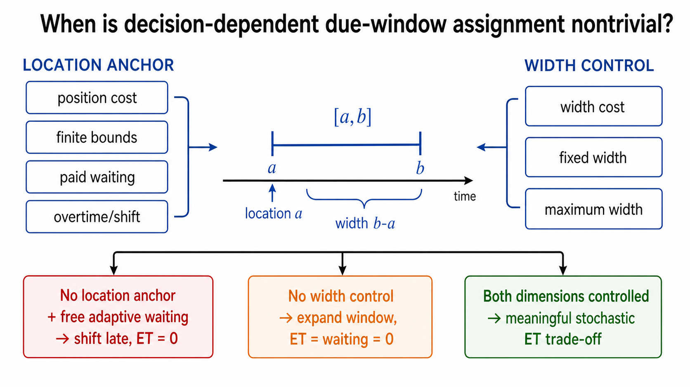

# 决策型 due window 的问题设定：文献对照、退化条件与 SAA 结构

本文针对当前仍在形成中的随机并行机调度问题，集中回答四个问题：Çelik et al. (2025) 与 Cavaliere et al. (2026) 中 overtime、等待和时间原点究竟怎样起作用；不用 overtime 时，位置成本、范围约束和等待成本分别能否使 due-window assignment 保持非平凡；窗口宽度成本在什么条件下可以删除；确定性 DDA 中“先投影 due date/window，再得到完工时间函数”的思路能否扩展到 SAA。

当前主要结论是：**机器问题完全可以不设 overtime，但必须分别处理窗口位置和窗口宽度两个自由度。** 位置可以由位置成本、有限承诺范围、正的主动等待成本或真实的班次成本锚定；宽度则必须由正的宽度成本、固定宽度或最大宽度控制。只控制其中一项，另一项仍会导致 due-window 决策退化。对当前希望保留场景自适应 timing 的研究，最值得作为主模型的是“宽度成本 + 期望 ET + 二阶段主动等待成本”；“位置成本 + 宽度成本 + earliest-start”可作为最接近随机 DDA 文献的基准；任务承诺范围适合作为具有业务数据时的第三种设定。

图 1 的核心不是要求同时使用所有成本，而是说明位置和宽度是两个独立维度：任一维度完全免费，模型都可能通过整体后移或无限放宽窗口消掉 ET。

## 1. 两篇 TWATSP 中的时间、等待与 overtime

### 1.1 时间是否从 0 开始，等待是否计入总时间

Cavaliere et al. (2026) 在每个场景中固定仓库出发时刻 $w_{0\omega}=0$。客户时间变量是绝对时刻，弧上的时间传播约束使用“不得早于前一客户时间加服务和旅行时间”的下界形式，因此约束中的富余量就是可以主动插入的等待。最终返回时间由最后一个客户的时刻加返程旅行时间得到，超过司机班次长度 $T$ 的部分计为 overtime。由此，旅行、服务和沿途等待都会推迟最终返回，等待虽然没有单独的 waiting-cost 项，却会通过 overtime 间接付费。

Çelik et al. (2025) 的结构相同，只是固定的出发时刻写为 $t_0$，不一定在符号上取 0。其 $w_{i\omega}$ 同样是日历时间变量，时间传播不要求等号，因此允许等待；最后返回超过 $T$ 的部分进入 overtime。把 $t_0$ 视为班次时钟的原点后，两篇论文计算的都是从班次开始到返回仓库的经过时间，而不是只计算车辆移动时间。

因此，2026 年论文第 6.2.3 节所说的“在客户前插入等待”并非免费地消失在总时长之外。等待会进入绝对访问时刻和返回时刻；只是当 $T$ 足够大时，插入这些等待仍不超过班次，overtime 也为 0。此时宽度、ET 和 overtime 可以同时归零，只剩 routing cost。作者控制 $T$，正是为了避免生成这种缺少时间权衡的实例。

### 1.2 删除 overtime 后到底剩下什么

若客户/任务拥有各自可决策的窗口，场景实现后又允许分别等待，则对任意固定路线或机器序列，都可以递归设置足够晚的共同目标时刻，并让较快场景等待到目标。Cavaliere et al. (2026) 允许零宽窗口，于是可令每个客户的窗口为一个点，所有场景的 ET 和宽度成本均为 0；删去 overtime 后，目标确实只剩 TSP 路线成本。严格地说，原文是单车 TSP/ATSP 结构，不是多车 VRP；如果扩展为多车，才是只剩 VRP 成本。

Çelik et al. (2025) 要求窗口长度至少等于服务时间。相同构造会使 ET 为 0、窗口全部取最小长度，宽度成本变成与路线无关的常数。因此目标是 routing cost 加常数，随机 time-window assignment 同样不再影响路线决策。

这不表示两篇原问题“没意义”。在其运输语境中，司机班次和 overtime 本来就是运营约束和成本；它同时承担了数学上的窗口位置锚。问题只发生在把该结构移植到没有班次语义的机器调度、删除 overtime，却继续保留自由窗口和免费自适应等待时。

## 2. 文献中常见的 due-window 控制方式

本节以 `DDA_literature_final.xlsx` 为导航，并回到代表性论文全文核对。Excel 中的摘录用于定位，不作为最终证据。Janiak et al. (2015) 的综述表 4 直接列出了经典目标

$$
\sum_j(\alpha E_j+\beta T_j)+\gamma(b-a)+\delta a,
$$

即 ET、窗口宽度和窗口起点成本。综述同时指出，common due-window 研究通常分为固定宽度与位置可决策、以及位置和宽度同时可决策两类。Yue and Wan (2016) 与 Zhang et al. (2024) 将这一思路用于任务特定的 DIF due window；Yue and Zhou (2021) 进一步在随机加工时间下使用任务特定窗口，并最小化期望 ET、窗口位置和窗口宽度成本。Shabtay et al. (2022) 的 common-window 模型同时设置位置成本、宽度成本以及位置和宽度的上界。

据此，用户提出的位置成本、范围约束都属于有明确文献基础的建模方式；但它们在“是否允许二阶段主动等待”这一点上不能直接照搬，因为大量确定性 DDA/DWA 论文证明或直接假设无主动 idle。

### 2.1 位置成本 + 宽度成本，不设 overtime

设任务 $j$ 的窗口为 $[a_j,b_j]$，位置成本为 $\rho_j a_j$，宽度成本为 $\lambda_j(b_j-a_j)$。在不允许主动等待或给定排程后完成时刻固定时，目标

$$
\rho_j a_j+\lambda_j(b_j-a_j)
+\mathbb E[\alpha_j(a_j-C_j)^++\beta_j(C_j-b_j)^+]
$$

是标准且可行的随机 DWA 结构。位置成本表达“承诺越晚，客户越不满意或需要更大折扣”，宽度成本表达“承诺区间越宽，服务精度越低”。Yue and Zhou (2021) 正是采用这四部分成本，只是直接使用已知分布或均值—方差信息，而不是 SAA。

但若保留 2026 风格的免费场景自适应等待，结论会变化。对单个任务，或等待该任务不会影响其他任务时，快速场景可以免费等到窗口，earliness 会严格归零；在完整序列中，等待一个任务会推迟后续任务并可能制造 tardiness，因此不能无条件断言所有最优解都没有早到。位置完全自由时，可以进一步沿序列递归后移所有窗口，才得到全局 ET 为零的退化构造。位置成本可以阻止这种无限后移，却未必保留充分的双侧 ET 权衡；窗口还常在 $[0,q]$ 与点窗口 $[q,q]$ 两种极端之间选择。详细的一任务样本推导和序列耦合边界见第 10.1 节。

因此，该设定最适合作为 **earliest-start/no-voluntary-idle 基准模型**。若要允许二阶段等待，应同时对主动等待收费，或者明确接受 earliness 在最优解中很少出现这一结构性质。

### 2.2 给 due window 设置范围

可以设置任务特定的承诺范围

$$
L_j\le a_j\le b_j\le U_j,
$$

也可以只对窗口起点、终点或宽度设置上界。Shabtay (2016) 说明，客户可接受 lead time 与 due-date 上界具有直接业务含义，并且限制会把投影后的问题变为带多个折点的完工时间成本。Shabtay et al. (2022) 也同时考虑 common-window 位置和长度的上界。

范围约束能消除“无限后移”，但**范围约束本身不一定使窗口决策有内容**：

1. 若宽度无成本且可变，通常直接取最宽的 $[L_j,U_j]$；
2. 若有正宽度成本但二阶段等待免费，常出现点窗口 $[U_j,U_j]$，较快场景全部等待到 $U_j$，只对超过 $U_j$ 的场景付 tardiness；
3. 若禁止主动等待，或者等待有正成本，最优窗口才通常位于范围内部，并由样本完成时间分布决定。

所以，范围约束是很好的业务边界，却不应被当成自动产生双侧 ET 的充分条件。若当前没有可靠的客户承诺区间数据，不宜仅为防退化人为生成很窄的 $[L_j,U_j]$；否则问题难度和结果主要由人为边界决定。较自然的做法是把它作为有数据时的主模型，或作为位置成本/等待成本模型的敏感性设定。

### 2.3 用二阶段主动等待成本代替 overtime

这一方向适合机器调度，而且比虚构机器 overtime 更自然。令 $I_{j\omega}$ 表示任务 $j$ 在场景 $\omega$ 中相对于最早可开始时刻的主动等待。若 $i$ 是同一机器上的前序任务，可写

$$
I_{j\omega}\ge
S_{j\omega}-C_{i\omega}-s_{ij\omega},
$$

若 waiting cost 被用作唯一的绝对位置锚，还要处理每台机器从时间 0 到首任务开始的 initial idle：可以将其计入等待，也可以直接固定每台启用机器的首任务从 0 开始。目标增加 $\eta_j I_{j\omega}$，正系数会使该不等式在最优解中准确记录所定义的主动等待。若业务上班前空闲确实没有成本，则不应强行收费，应改用时间原点规范化、位置成本或承诺范围，详见第 10.3 节。

等待成本的业务含义可以是机器空转的能源、占用稀缺产能、操作人员等待或延迟后续任务的机会成本。Schaap et al. (2022) 在给定 multiple time windows 的 VRP 中显式最小化总等待成本，说明这一成本在 timing/route 模型中是正常的；Elyasi and Salmasi (2013) 则指出，随机 ET 调度经常通过“机器 idle 成本高于 earliness 成本”来解释 no-idling 假设。不过，本轮核对的 DWA 文献没有提供“窗口完全自由且只加等待成本”的同型模型，因此这里应表述为基于已有 timing 成本的合理扩展，而不是声称直接复制某篇随机 DIF-window 论文。

必须区分两类成本：任务完工后等到交付所产生的库存/holding cost，通常已经由 earliness 表示；机器在加工前主动空闲的成本才是这里的 $\eta I$。若把两者都叫 waiting cost，很容易重复计费。

对于一个点窗口 $q$，忽略下游任务影响，设 $\underline C$ 为不等待时的最早完成时刻，则

$$
\min_{I\ge0}
\left\{
\alpha(q-\underline C-I)^+
+\beta(\underline C+I-q)^+
+\eta I
\right\}
=
\begin{cases}
\min\{\alpha,\eta\}(q-\underline C), & \underline C<q,\\
\beta(\underline C-q), & \underline C\ge q.
\end{cases}
$$

该式清楚说明等待成本的作用。$\eta=0$ 时，早到一侧的有效斜率为 0，快速场景可以免费等到目标；$0<\eta<\alpha$ 时，模型愿意等待来替代一部分 earliness；$\eta\ge\alpha$ 时，仅为避免单个任务早到而等待没有收益，模型接近 no-idling。真实序列中，一次等待还会移动所有后续任务，因此不能逐任务完全分离，但连续 LP 结构不变。

需要特别纠正的是：**若“不在外边加入 due-window 成本或限制”也包括删除宽度成本，等待成本单独不够。** 只需把窗口取成足够宽的 $[0,M]$，就能令 ET 和主动等待都为 0。等待成本只能锚定位置，不能约束宽度。该方案可行的最小版本是

$$
\lambda_j(b_j-a_j)
+\mathbb E_\omega[
\alpha_jE_{j\omega}+\beta_jT_{j\omega}+\eta_jI_{j\omega}],
\qquad \lambda_j>0, \eta_j>0,
$$

或者将宽度固定/设置真实最大值后再删除 $\lambda_j(b_j-a_j)$。

### 2.4 有 overtime 时，宽度成本是否可有可无

不是。overtime 与宽度成本控制的是不同自由度：overtime 使整体时间线向后移动要付费，宽度成本使承诺区间变宽要付费。若保留 overtime、删除宽度成本且宽度没有上界，每个客户都可得到覆盖所有可能访问时刻的巨大窗口，ET 为 0，最终只剩 routing 和 overtime；due-window assignment 本身变成无信息的“尽量宽”。

只有以下情况可以删除宽度成本：窗口宽度由客户预先给定；窗口宽度有不可随意取大的硬上界，而且研究者接受最优解通常取该上界；或模型不研究宽度决策，只研究固定宽度窗口的位置。若论文希望把“窗口长度也是决策”作为问题的一部分，正宽度成本通常不是装饰项，而是必要的服务精度权衡。

## 3. 四类设定的退化检查

下表把前述判断压缩成可直接用于建模审计的条件。这里默认每个任务有独立窗口，并允许场景实现后主动等待。

| 位置机制 | 宽度机制 | 等待机制 | 典型结果 |
|---|---|---|---|
| 无 | 无 | 免费 | 窗口无限后移或放宽，ET、等待均为 0 |
| 位置成本或 overtime | 无 | 任意 | 窗口尽量放宽，DWA 宽度决策退化 |
| 无 | 正宽度成本 | 免费 | 零宽窗口整体后移，ET 为 0 |
| 有限 $[L,U]$ | 正宽度成本 | 免费 | 常趋向 $[U,U]$，变成给定 due date 型调度 |
| 位置成本 | 正宽度成本 | 禁止主动等待 | 非平凡；窗口是完成时间分布的分位数区间 |
| 无或有位置成本 | 正宽度成本 | 正等待成本，且 initial idle 计费或首任务时刻固定 | 非平凡；等待、ET 与窗口精度共同权衡 |
| 真实范围 | 固定/有成本宽度 | 禁止等待或正等待成本 | 非平凡且业务解释最强 |

多场景“共享同一窗口”本身不是位置机制。每个场景若拥有独立免费等待，就仍能同步到共同目标。多机器也不会改变这一结论；只需在每台机器上分别递归后移。若仅用 waiting cost 锚定绝对位置，则每台机器的 initial idle 必须计费，或把首任务开始时刻固定为 0；否则整台机器的序列和窗口可一起免费平移。若另有位置成本或有限日历范围，initial idle 不必再承担这一数学作用。

## 4. 为什么确定性问题经常变成完工时间函数

### 4.1 最简单的 DIF 窗口会直接化为加权完工时间

给定一个确定性完工时刻 $C_j$，考虑不受限的任务特定窗口：

$$
F_j(C_j)=
\min_{0\le a_j\le b_j}
\left\{
\alpha_j(a_j-C_j)^+
+\beta_j(C_j-b_j)^+
+\rho_j a_j
+\lambda_j(b_j-a_j)
\right\}.
$$

最优解不会取 $a_j>C_j$ 或 $b_j>C_j$。在三角形 $0\le a_j\le b_j\le C_j$ 上，目标是线性的，最优点只可能是

$$
(a_j,b_j)=(0,0),\ (0,C_j),\ (C_j,C_j),
$$

对应成本分别为 $\beta_jC_j$、$\lambda_jC_j$ 和 $\rho_jC_j$。因此

$$
F_j(C_j)=\min\{\beta_j,\lambda_j,\rho_j\}C_j.
$$

这严格验证了用户的判断：很多确定性 DIF due-window 模型先把窗口写成完工时间的最优响应，最后确实只剩一个 regular completion-time scheduling problem。此时 earliness 系数甚至不会进入投影函数，最优解没有早到任务；窗口只是用于解释最终的完工时间成本。若系数相同，问题更容易退化为 $\sum_j C_j$ 型排序；若系数任务相关，则为加权完工时间型问题。

这不是模型错误，而是其结构结论。但若研究目标是让窗口位置、长度和双侧 ET 都真正参与决策，仅使用“无限制 DIF + 线性位置/宽度成本”的确定性模型，创新和计算难度可能有限。可通过任务特定 acceptable lead time、端点上界、固定/最小宽度、common-window 耦合或不确定性增强结构。Shabtay (2016) 的 restricted DDA 正是把投影函数变成关于 $C_j-A_j$ 与 $C_j-\bar d_j$ 的多折点函数，而不再只是一个线性系数。

### 4.2 范围与 acceptable lead time 会留下分段函数

若位置成本只在超过客户可接受时刻 $A_j$ 后发生，例如 $\rho_j(a_j-A_j)^+$，或要求 $a_j,b_j\le U_j$，最优端点会在 $0,A_j,U_j,C_j$ 等有限折点间选择。窗口仍可被投影掉，但 $F_j(C_j)$ 变成分段线性函数。对单机，这类 regular 函数常能继续证明 no-idle；对并行机和任务相关折点，分配与排序通常仍然困难。

因此，“最终写成完工时间函数”不等于“问题一定没有意义”。关键是投影后的函数是单一线性斜率，还是包含任务相关折点、非规则区段或任务间耦合。范围设定的主要价值正是改变投影函数的形状，而不仅是防止数值无界。

## 5. SAA 能否沿用这一分析思路

### 5.1 可以，但标量函数变成场景完成时间向量的函数

采用 earliest-start 或 no-voluntary-idle 后，给定排程 $x$，每个场景的完成时刻 $C_{j\omega}(x)$ 已确定。对任务 $j$ 投影窗口得到

$$
\Phi_j(\mathbf C_j(x))=
\min_{0\le a_j\le b_j}
\left\{
\rho_ja_j+\lambda_j(b_j-a_j)
+\frac1N\sum_{\omega=1}^N
\left[
\alpha_j(a_j-C_{j\omega}(x))^+
+\beta_j(C_{j\omega}(x)-b_j)^+
\right]
\right\},
$$

其中 $\mathbf C_j=(C_{j1},\ldots,C_{jN})$。它仍然是“完工时间函数”，但不再是单个 $C_j$ 的函数，而是一个经验分布/场景向量的凸分段线性函数。共同窗口把所有样本耦合在一起，因此不能投影成 $N$ 个互不相关的场景成本。

在端点不受边界和 $a_j\le b_j$ 耦合影响的内部情形，记 $\widehat F_j$ 为经验分布函数，则端点满足

$$
\widehat F_j(a_j^*)=\frac{\lambda_j-\rho_j}{\alpha_j},
\qquad
\widehat F_j(b_j^*)=1-\frac{\lambda_j}{\beta_j}.
$$

也就是说，窗口端点是经验分位数。若第一个比例不为正，最优起点落在 0 或给定下界；若两个分位数交叉，窗口收缩为点 $a_j=b_j=d_j$，其经验分位水平为

$$
\widehat F_j(d_j^*)=
\frac{\beta_j-\rho_j}{\alpha_j+\beta_j},
$$

并需按 $[0,1]$ 和业务边界截断。Yue and Zhou (2021) 在正态分布下得到的最优端点正是相同的一阶条件，只是用理论分布分位数；SAA 将其自然替换为经验分位数。

因此，SAA 不仅可行，而且恰好避免了确定性模型中“每个任务只有一个 $C_j$，窗口立刻化成单一线性系数”的极端简化。不同场景的累计加工时间随机器分配和顺序改变，经验分位数及其排序也随之改变，排程仍是组合问题。

### 5.2 免费自适应等待会破坏上述直接投影

若 $C_{j\omega}$ 不是给定排程下的 earliest completion，而是二阶段可通过等待调整的变量，则不能先把样本完成时间排序、再独立求窗口。窗口、当前任务等待和下游任务完成时刻必须在一个联合 LP 中优化。更重要的是，若等待免费且缺少位置锚，SAA 也会像第 1 节的构造一样退化；场景协同本身不能防止这一点。

加入正 waiting cost 后，联合投影仍然成立，只是值函数变为

$$
Q(x)=
\min_{a,b,S,C,E,T,I}
\left\{
\sum_j\lambda_j(b_j-a_j)
+\frac1N\sum_{\omega,j}
(\alpha_jE_{j\omega}+\beta_jT_{j\omega}+\eta_jI_{j\omega})
\right\},
$$

并满足所有场景 timing 与同一组窗口约束。它通常没有简单的逐任务分位数闭式解，但仍是一个连续 LP 值函数，正适合 2026 风格的 projected Benders。窗口留在 master 时，也可使用 2025 风格的 two-step Benders。

### 5.3 一个两场景直观例子

设某任务不等待时的两个场景完成时刻为 4 和 10，概率各为 0.5，$\alpha=\beta=1$。若等待免费、位置也免费，取点窗口 $[10,10]$，场景 4 等待 6，两个场景 ET 均为 0，宽度也为 0。

若主动等待单价 $\eta=0.3$、宽度单价 $\lambda=0.1$，点窗口 $[10,10]$ 的期望等待成本为 $0.5\times6\times0.3=0.9$；取窗口 $[4,10]$ 的宽度成本为 $6\times0.1=0.6$，不产生 ET 和等待。模型会选择正宽度窗口。这个例子说明等待成本不是简单增加一个目标项，而是使“用宽窗口吸收不确定性”与“用场景等待同步完成”真正产生可调权衡。

## 6. 对当前并行机问题的推荐设定

### 6.1 主模型：保留二阶段 timing，并对主动等待收费

若研究重点仍是模仿 2026 年论文，让场景实现后调整具体执行时间，推荐主模型采用

$$
\min\ c^{\mathrm{seq}}(x)
+\sum_j\lambda_j(b_j-a_j)
+\frac1N\sum_{\omega,j}
\left(
\alpha_jE_{j\omega}
+\beta_jT_{j\omega}
+\eta_jI_{j\omega}
\right),
$$

其中 $\lambda_j>0,\eta_j>0$，不设 overtime。任务间主动 idle 计入 $I$；对 initial idle，应在“计费”和“固定每台启用机器的首任务从 0 开始”之间按业务语义选一个。该模型同时控制宽度与位置，保留连续 recourse，并让等待成为真正的二阶段调整动作。若有可信的 $[L_j,U_j]$，可再作为业务约束加入，而不是把它当成唯一防退化工具。

该版本相对现有随机 DWA 文献的区别也很清楚：Yue and Zhou (2021) 强制无 idle；本模型允许根据场景主动等待，但显式计算其机会成本。这比添加没有生产语义的 overtime 更自然，也能形成明确的方法贡献。

### 6.2 文献基准：位置成本 + 宽度成本 + no voluntary idle

第二个模型建议使用

$$
\min\ c^{\mathrm{seq}}(x)
+\sum_j[\rho_ja_j+\lambda_j(b_j-a_j)]
+\frac1N\sum_{\omega,j}
(\alpha_jE_{j\omega}+\beta_jT_{j\omega}),
$$

并强制 earliest-start/no-voluntary-idle。它与 Yue and Zhou (2021) 最接近，窗口可通过经验分位数投影，适合作为结构清楚的 SAA 基准。其不足是没有完整的 wait-and-see timing；如果把等待重新开放而不收费，需接受 earliness 弱化和窗口极端化的风险。

### 6.3 范围模型：只有存在业务承诺区间时作为主设定

第三个模型可用 $L_j\le a_j\le b_j\le U_j$ 代替位置成本。为避免总取边界，仍应采用正 waiting cost、no-idling、固定宽度或正宽度成本中的适当组合。范围可从客户可接受 lead time、历史交付承诺或排程周期生成；若只是按 makespan 人为截取，应做多档敏感性分析，并报告多少窗口端点落在边界，否则模型结果可能主要反映边界设置。

### 6.4 不建议作为主模型的版本

不建议使用“自由位置 + 自由宽度 + 仅 waiting cost”，因为窗口会无限放宽；也不建议使用“范围 + 正宽度成本 + 免费等待”并宣称在优化窗口位置，因为它常直接取 $[U_j,U_j]$。机器没有明确班次时，不建议为了模仿 TWATSP 人为增加 overtime。

综合而言，最有价值的模型比较不是简单比较三种随意成本，而是比较两种 timing 语义：

1. **P 模型**：位置成本 + 宽度成本 + SAA-ET，禁止主动等待；
2. **W 模型**：宽度成本 + SAA-ET + 二阶段主动等待成本，允许场景自适应 timing。

两者分别对应“承诺时间本身收费”和“执行阶段为了追赶承诺而等待收费”。若再加入范围模型，应把它作为有业务数据的 B 版本。这样模型差异有清楚含义，也能回答自适应等待到底带来多少价值。

## 7. 对 Benders、SAA 与后续 DRO 的影响

上述 P、W、B 三类模型只要使用线性 ET、线性位置/宽度/等待成本，固定离散排程后的 timing recourse 都是连续 LP。位置成本只改变第一阶段目标；端点范围只增加简单边界；waiting cost 只改变 recourse 目标系数。它们都不妨碍 ordinary Benders、deepest Benders cuts 或 2025/2026 两种分解边界。

P 模型在给定排程后可按经验分位数投影，最适合研究解析结构和 2026 风格的小 master。W 模型的等待会影响下游完成时间，需联合优化窗口和所有场景 timing，但仍是 LP；它更适合验证 2025 two-step 与 2026 projected Benders 的差异。范围约束还能消除连续时间平移方向，通常有利于数值稳定和 cut 强度。

实验应先用小规模确定性等价 MIP 验证最优值，再比较两种 Benders。不同问题设定不能只比较各自的目标值，应在同一 OOS 场景上统一报告期望 earliness、tardiness、窗口宽度、窗口起点、主动等待、早到/迟到比例以及排程成本。SAA 还需报告样本规模稳定性和独立 OOS 置信区间，避免把某一批样本的经验分位数当成真实最优承诺。

后续 Wasserstein-DRO 仍可沿用：若加工/换型时间进入 timing 约束右端，recourse 连续，位置、宽度和 waiting cost 不会破坏基本对偶结构。应先完成 SAA 并确认模型没有退化，再做 DRO；否则 DRO 只是在一个已经能把 ET 消掉的模型上增加计算量。

## 8. 文献证据与当前判断的边界

| 文献 | 本轮核对到的设定 | 对当前问题的直接含义 |
|---|---|---|
| Janiak et al. (2015), EJOR 242, 347–357 | 综述固定/可变 common due window；经典目标含 ET、位置和宽度成本 | 位置成本与宽度成本是不同控制项 |
| Yue and Wan (2016), JORS 67, 872–883 | SLK/DIF 窗口；DIF 无位置限制；ET 或早/迟任务数，加位置和宽度成本；no idle | 支持任务特定窗口与确定性投影，但不支持免费二阶段等待 |
| Yue and Zhou (2021), EJOR 290, 453–468 | 随机加工时间、任务特定 DIF 窗口；期望 ET、位置、宽度成本；no idle | 是 P 模型和 SAA 分位数投影的最接近基准 |
| Shabtay (2016), EJOR 252, 79–89 | acceptable lead time 成本与 due-date 上界；投影为多折点完工时间函数 | 支持范围/软范围设计，说明投影后仍可保持复杂结构 |
| Shabtay et al. (2022), EJOR 303, 66–77 | common due date/window；early/late work；位置、宽度成本和上界 | 证明成本与范围可以并存，不是互斥设定 |
| Zhang et al. (2024), JCO 48:43 | unrestricted DIF window；ET、早/迟数量、位置和宽度 | 说明近期确定性 DIF 研究仍主要依赖位置/宽度成本 |
| Schaap et al. (2022), Transportation Science 56, 1369–1392 | 给定 multiple time windows 的 VRP，显式总 waiting cost | 支持 waiting cost 的 timing 语义，但窗口不是自由分配 |
| Çelik et al. (2025); Cavaliere et al. (2026) | 自由窗口位置、宽度成本、场景等待、司机班次/overtime | overtime 锚定位置；不能原样删掉后仍假设多场景会自动防退化 |

本轮没有在 Excel 及其代表性 DWA 全文中确认到“任务特定窗口位置和宽度均完全自由、没有任何窗口成本/边界，仅靠二阶段 waiting cost”的同型研究。因而 W 模型的合理性来自机制推导和给定窗口 timing 文献，而不是某篇完全相同模型。这个证据边界应在后续论文中如实表述。

## 9. 当前建议

现阶段不需要给机器增加 overtime。先把 W 模型作为主要的两阶段 SAA 问题：任务分配、顺序和 due window 为第一阶段，场景下 timing 与主动等待为第二阶段；保留正宽度成本并对任务间主动 idle 收费，initial idle 则按业务选择计费、固定为 0 或由其他位置机制锚定。再用 P 模型作为随机 DDA 文献基准，禁止主动等待并研究经验分位数投影。若能获得有含义的任务承诺范围，再加入 B 模型，而不是先随意规定边界。

这样既保留 due window 必须决策的核心，也不会把问题简化为只剩并行机排序或只剩 VRP。理论上可以分别研究 P 模型的 order-statistic 投影与 W 模型的 LP 值函数/Benders；计算上可以在相同样本和 OOS 场景下比较“不能等”和“可以付费等”的价值，问题设定、算法贡献和管理含义能够对应起来。

## 10. 进一步澄清：免费等待、范围上界与带 overtime 的投影

### 10.1 免费等待时，为什么单任务的 earliness 会消失

先把序列耦合拿掉。固定任务 $j$ 的窗口 $[a_j,b_j]$，记 $\underline C_{j\omega}$ 为场景 $\omega$ 下不等待时的最早完成时刻。若实际完成时刻可以通过免费等待向右移动，则场景 recourse 为

$$
r_{j\omega}(a_j,b_j)=
\min_{C_{j\omega}\ge \underline C_{j\omega}}
\left\{
\alpha_j(a_j-C_{j\omega})^+
+\beta_j(C_{j\omega}-b_j)^+
\right\}.
$$

当 $\underline C_{j\omega}<a_j$ 时，令 $C_{j\omega}=a_j$；当 $a_j\le \underline C_{j\omega}\le b_j$ 时，不等待；当 $\underline C_{j\omega}>b_j$ 时，任务已经太晚，等待无法补救。因此

$$
r_{j\omega}(a_j,b_j)
=\beta_j(\underline C_{j\omega}-b_j)^+.
$$

这说明，在该局部模型中，earliness 不是因为“单位成本太高”才消失，而是因为它可以由一个零成本、只向右移动时间的 recourse 动作完全消除。$\alpha_j$ 根本不进入投影后的目标。真正需要权衡的是窗口推迟的价格与无法通过等待消除的 tardiness。

加入位置成本 $\rho_ja_j$ 和宽度成本 $\lambda_j(b_j-a_j)$ 后，固定 $b_j$ 时，关于 $a_j$ 的部分为

$$
(\rho_j-\lambda_j)a_j+\lambda_jb_j.
$$

若 $\rho_j<\lambda_j$，取 $a_j=b_j$，形成点窗口；若 $\rho_j>\lambda_j$，取 $a_j=0$，用从 0 开始的宽窗口；两者相等时中间值均可。定义

$$
\kappa_j=\min\{\rho_j,\lambda_j\},
$$

则剩余问题等价于

$$
\min_{b_j\ge0}
\left\{
\kappa_jb_j+
\frac{\beta_j}{N}\sum_{\omega=1}^N
(\underline C_{j\omega}-b_j)^+
\right\}.
$$

当 $0<\kappa_j<\beta_j$ 时，$b_j$ 是经验完成时间的 $1-\kappa_j/\beta_j$ 分位数；当 $\kappa_j\ge\beta_j$ 时，窗口推迟的单位价格不低于 tardiness，最优 $b_j$ 落在 0 或给定下界；当 $\kappa_j=0$ 时，最小的最优选择是

$$
b_j^*=\max_\omega \underline C_{j\omega}.
$$

所以，用户提出的“把窗口开始设成所有 sample 中最迟的完成时刻”在**位置完全免费、宽度又鼓励收缩为点窗口**的局部情形下是正确的。但原因不是 early cost 大，而是窗口推迟和等待都不收费；只要位置成本为正，就通常选择一个上分位数，而不是最坏样本。

完整机器序列中还要多一层：等待任务 $j$ 会推迟同一机器上的所有后续任务，可能增加其 tardiness。因此，对固定窗口，消除任务 $j$ 的 earliness 未必改善总目标。例如前一任务的窗口很晚、后一任务的窗口很早时，为使前一任务准时而等待可能让后一任务严重迟到。此时应由联合 timing LP 决定是否保留部分 earliness，不能逐任务套用上式。只有当窗口位置也完全自由，可以沿序列递归设置越来越晚的目标窗口时，才能构造所有任务、所有场景 ET 同时为零的全局退化解。

若等待单价为 $\eta_j>0$，单任务早到一侧的有效单位成本变为 $\min\{\alpha_j,\eta_j\}$：模型可以选择直接承担 earliness，或等待到窗口开始。此时 early cost 才会重新进入窗口分位数与 timing 权衡。

### 10.2 为什么“范围 + 免费等待”会取 $[U_j,U_j]$

考虑没有位置成本、宽度单价 $\lambda_j>0$、免费等待且

$$
L_j\le a_j\le b_j\le U_j.
$$

利用上一节的单任务投影，窗口问题变为

$$
\min_{L_j\le a_j\le b_j\le U_j}
\left\{
\lambda_j(b_j-a_j)
+\frac{\beta_j}{N}\sum_\omega
(\underline C_{j\omega}-b_j)^+
\right\}.
$$

对固定的 $b_j$，取 $a_j=b_j$ 可使宽度成本为 0；得到点窗口后，增大 $b_j$ 只会减少 tardiness，又没有位置成本，因此 $b_j=U_j$ 一定是一个最优选择。若直到 $U_j$ 仍有样本迟到，目标通常会把右端点严格推到 $U_j$；若某个 $b_j<U_j$ 已经不再产生 tardiness，则从该点到 $U_j$ 可能形成一段平坦的最优区间。此时 $[U_j,U_j]$ 仍是最优解，但不一定是唯一最优解。典型边界解可写为

$$
[a_j^*,b_j^*]=[U_j,U_j].
$$

较快场景免费等待到所选点，超过该点的场景承担 tardiness。这里 due-window 位置没有形成真正的内部权衡：它要么被推到外生上界，要么落在一段目标完全相同的平坦区间中。模型实质上更接近一个由 $U_j$ 或最迟样本确定 due date 的随机调度问题。

这个结论同样有条件。若没有宽度成本，模型反而倾向选择最宽的允许窗口，例如 $[L_j,U_j]$；若有位置成本、正 waiting cost、禁止主动等待，或等待会显著损害后续任务，最优端点可能位于区间内部。因此文档使用“经常取 $[U_j,U_j]$”，而不是无条件定理。

### 10.3 宽度控制为何通常存在，initial idle 是否必须收费

本轮核对的文献显示，当窗口宽度是决策变量时，主流做法确实会设置某种宽度控制：

1. Janiak et al. (2015) 将 variable-size common due-window 的典型目标概括为 ET 加窗口宽度成本，部分模型再加位置成本；固定宽度类问题则无需重复收费；
2. Yue and Wan (2016)、Yue and Zhou (2021) 以及 Zhang et al. (2024) 的 DIF due-window 模型都包含窗口位置和宽度成本；
3. Shabtay et al. (2022) 同时使用窗口位置成本、宽度成本和相应上界；
4. Çelik et al. (2025) 与 Cavaliere et al. (2026) 也都保留正的 time-window width cost。

因此，并不是所有论文都必须采用线性宽度成本，但**只要宽度本身需要优化，就一般需要宽度成本、固定宽度、最大宽度、服务水平约束或双目标中的至少一种**。若什么都没有，最宽窗口弱支配窄窗口，窗口长度决策没有意义。

initial idle 是否收费是另一个问题。此前“必须计费”的准确含义是：若 waiting cost 是模型中唯一的绝对位置锚，则免费 initial idle 会留下如下时间平移：

$$
S'_{j\omega}=S_{j\omega}+\Delta,
\quad C'_{j\omega}=C_{j\omega}+\Delta,
\quad a'_j=a_j+\Delta,
\quad b'_j=b_j+\Delta.
$$

宽度、ET 和所有任务间 idle 都不变；如果 initial idle 也不计价，又没有位置成本、日历边界或 overtime，任意 $\Delta\ge0$ 都得到相同目标值。于是窗口的绝对位置不可识别，场景还可利用各自免费的开工延迟进行同步。

但这不是说现实中“机器在生产计划开始以前没有开工”一定有成本。如果该成本缺少业务依据，有三种更自然的处理：

1. 把每台启用机器的首任务开始时刻固定为 0，只对任务之间的主动 idle 收费；此时 0 表示该机器实际生产周期的起点；
2. 保留日历时间语义，用窗口位置成本或真实的 $[L_j,U_j]$ 锚定窗口，initial idle 可以不收费；
3. 把首任务开始时刻作为第一阶段共同决策，禁止各场景分别免费改变它，从非预见性而不是成本上消除同步自由度。

因此，initial idle 计费只是“waiting cost 单独承担位置锚”时的一种数学实现，不是当前问题必须采用的业务假设。若用户认为它不现实，当前更推荐固定启用机器首任务从 0 开始，并只计算生产过程中的主动空闲。

### 10.4 带 overtime 的 TWA 能否写成完工时间函数

可以，但要区分两种“函数”。若固定路线和各场景的实际客户服务/完成时刻 $C_{i\omega}$，窗口可以逐客户投影：

$$
\Phi_i(\mathbf C_i)=
\min_{a_i\le b_i}
\left\{
\lambda_i(b_i-a_i)
+\sum_\omega p_\omega
\left[
\alpha_i(a_i-C_{i\omega})^+
+\beta_i(C_{i\omega}-b_i)^+
\right]
\right\}.
$$

此时带 overtime 的总目标可以写成

$$
c^{\mathrm{route}}(x)
+\sum_i\Phi_i(\mathbf C_i)
+\psi\sum_\omega p_\omega(R_\omega-T)^+,
$$

其中 $R_\omega$ 是场景 $\omega$ 的最终返回/完工时刻。第一部分是路线成本，第二部分是各客户跨场景完成时刻向量的 order-statistic 函数，第三部分是最终完工时刻的 overtime 函数。这个意义下，确实可以把 due window 写成“完成时刻函数”。

但它不同于确定性 DIF-DDA 中的 $\sum_j f_j(C_j)$：

1. 一个窗口要同时服务多个场景，所以 $\Phi_i$ 是整个向量 $(C_{i1},\ldots,C_{iN})$ 的函数，不是单个标量；
2. 实际 TWA 中等待也是决策，$C_{i\omega}$ 会随窗口变化，不能先把它当成固定参数；
3. overtime 由最终返回时刻决定，一次等待会同时改变本客户、后续客户和 $R_\omega$，所以全局 timing 仍然耦合。

因此，实际可做的是先消去窗口，得到

$$
\min_{C,R}
\left\{
\sum_i\Phi_i(\mathbf C_i)
+\psi\sum_\omega p_\omega(R_\omega-T)^+
\right\}
$$

并保留路线上的时间传播约束；或者进一步把窗口和 timing 一起投影成路线变量 $x$ 的 recourse 值函数 $Q(x)$。Cavaliere et al. (2026) 的 projected Benders 本质上采用后一种意义，而不是为每个客户得到一个简单的标量完工时间系数。

在只有一个确定性场景且允许零宽窗口时，固定完成时刻后取 $a_i=b_i=C_i$，窗口部分为 0；若有最小宽度，则通常只剩最小宽度常数。此时真正影响 timing 的只剩最终返回 overtime，问题接近路线成本加 makespan/overtime。多场景共享窗口造成的完成时刻离散程度，以及等待可能引起的 overtime，才使随机 TWA 的投影保持非平凡。

## 11. 用具体数字重新解释模型为什么会退化

### 11.1 先把五个量完全分开

对任务 $j$，设 due window 为 $[a_j,b_j]$，实际完成时刻为 $C_{j\omega}$。五个容易混在一起的量分别是：

1. $a_j$ 是窗口开始位置，$b_j-a_j$ 是窗口宽度；把两个端点同时加上 $\Delta$ 是“平移窗口”，不会改变宽度；
2. $E_{j\omega}=(a_j-C_{j\omega})^+$ 表示任务在窗口开始以前完成；
3. $T_{j\omega}=(C_{j\omega}-b_j)^+$ 表示任务在窗口结束以后完成；
4. waiting 或主动 idle 只能把完成时刻向右推，不能把已经迟到的任务拉回左边；
5. overtime 按整条路线或整台机器的最终结束时刻计费，不等同于逐分钟 waiting cost。

因此，宽度成本控制的是“窗口不能无限变宽”，位置成本、真实位置范围、付费等待、固定首任务开工或 overtime 控制的是“窗口和排程不能一起无限向后平移”。这两类控制不能互相替代。

### 11.2 一个任务、三个 SAA 场景：免费等待怎样消掉 earliness

假设同一任务在三个等概率场景下，不主动等待时最早可在时刻

$$
4,\quad 7,\quad 10
$$

完成。现在选择零宽窗口 $[10,10]$，并允许每个场景免费决定等待量，则三个场景分别采用

| 场景最早完成时刻 | 等待 | 实际完成时刻 | earliness | tardiness |
|---:|---:|---:|---:|---:|
| 4 | 6 | 10 | 0 | 0 |
| 7 | 3 | 10 | 0 | 0 |
| 10 | 0 | 10 | 0 | 0 |

窗口宽度也是 0。若窗口位置不收费、没有上界、等待不收费且没有 overtime，则该任务的窗口成本和 ET 成本同时为 0。三个场景并没有把窗口拉向三个不同位置，因为窗口是共同的一阶段决策，而等待是各场景独立的二阶段决策；各场景恰好可以用不同等待量追到共同的最迟时刻 10。

所以，在有限 SAA 中，“多个场景共同决定一个窗口”不能自动防止退化。恰恰相反，只要等待免费，取有限样本中的最迟完成时刻就能同步所有较快样本。若真实分布无上界，则未必存在一个有限的最迟时刻，但在窗口后移完全免费时，模型仍可能不断把窗口推迟，使期望 tardiness 趋近于 0 而没有有限最优位置。

这里 early 单价 $\alpha$ 是 1、10 还是 1000 都没有影响，因为最优 recourse 从不支付 earliness。它不是“early 太贵，所以窗口放到最迟样本”，而是“免费等待已经把 early 这一项从局部值函数中删除”。

### 11.3 为什么不是“early 成本越大，窗口就放到最迟样本”

先看**不允许等待**的情形。仍取三个等概率完成时刻 $4,7,10$，把点窗口记为 $[d,d]$，令 early 单价 $\alpha=10$、tardy 单价 $\beta=1$：

| 点窗口 | 平均 early 成本 | 平均 tardy 成本 | 总 ET 成本 |
|---|---:|---:|---:|
| $[4,4]$ | 0 | $(3+6)/3=3$ | 3 |
| $[7,7]$ | $10\times3/3=10$ | $3/3=1$ | 11 |
| $[10,10]$ | $10\times(6+3)/3=30$ | 0 | 30 |

因此，early 单价很大时反而选择较早的点 4。原因很直接：窗口放得越晚，原本在 4 和 7 完成的任务离窗口越远，earliness 越大。若把 $\alpha$ 降到 0.1，则三个候选的总成本依次为 $3,1.1,0.3$，这时才会选择最迟样本 10。也就是说，在不能等待的普通 ET 模型里，是 **early 成本较低** 才更容忍把承诺时间向后放；early 成本较高通常会把窗口开始端点向左拉。

再看**允许免费等待**的情形。若选择 $d=10$，完成于 4 和 7 的场景分别免费等待 6 和 3 个时间单位，实际完成时刻都变为 10，所以根本不产生 early 成本。此时 $\alpha$ 无论取 0.1、10 还是 1000，结果都一样；最迟样本成为候选不是因为 $\alpha$ 大，而是因为等待把 early 项完全绕开了，同时窗口后移又不收费。

在免费等待下加入窗口位置成本后，最迟样本也不再总是最优。仍取样本 $4,7,10$，迟到单价 $\beta=10$，点窗口位置成本为 $\rho a=\rho b$。较早样本可免费等待，所以只需比较位置成本和迟到成本。

当 $\rho=1$ 时：

| 点窗口 | 位置成本 | 平均迟到成本 | 总成本 |
|---|---:|---:|---:|
| $[10,10]$ | 10 | 0 | 10 |
| $[7,7]$ | 7 | $10\times3/3=10$ | 17 |
| $[4,4]$ | 4 | $10\times(3+6)/3=30$ | 34 |

位置推迟很便宜，故选择最迟样本 10。当 $\rho=6$ 时，同样三个候选的总成本分别为

$$
60,\quad 42+10=52,\quad 24+30=54,
$$

最优位置变为中间样本 7。一般地，它是由位置单价与 tardiness 单价之比确定的经验上分位数。只有窗口后移的有效单价为 0 时，最小的最优位置才是最大样本。

这也解释了它与确定性 DDA 推导的关系：二者本质上都是把一个分段线性端点问题投影成 order statistic 或完工时间函数。但是，禁止等待时，early 和 tardy 两侧的系数都会决定窗口；免费等待时，局部 early 侧被消掉，剩下的是“窗口后移价格 versus tardiness”。因此不能再拿 $\alpha$ 与位置单价直接比较。

### 11.4 宽度成本只能防止窗口变宽，不能阻止窗口整体后移

仍用样本 $4,7,10$。若没有宽度成本，又禁止等待，窗口可取 $[4,10]$，三个样本的 ET 都为 0；还可以取更宽的 $[0,100]$。此时窗口宽度没有优化意义。因此，只要宽度是决策，就必须用正宽度成本、固定宽度、最大宽度、服务水平约束或第二目标中的至少一种来控制。

但是，正宽度成本并不能控制位置。窗口 $[10,10]$ 的宽度为 0，把它改成 $[100,100]$ 后宽度仍为 0。若执行时间也能通过免费等待一起向后移，宽度成本完全看不到这种平移。这正是原 TWA 中 width cost 与 overtime 同时存在的原因之一：前者控制承诺区间有多宽，后者让为了追逐很晚窗口而产生的总延迟最终付出代价。

若同时设置开始位置成本 $\rho a$ 和宽度成本 $\lambda(b-a)$，固定右端点 $b$ 后，把左端点 $a$ 向右移动一单位，会增加 $\rho$ 的位置成本，但节省 $\lambda$ 的宽度成本。因此：

- $\lambda>\rho$ 时更愿意把 $a$ 推到 $b$，形成点窗口；
- $\rho>\lambda$ 时更愿意把 $a$ 拉到 0，形成 $[0,b]$；
- 右端点 $b$ 再由有效位置价格 $\min\{\rho,\lambda\}$ 与 tardiness 权衡。

这说明在“免费等待 + 线性位置和宽度成本”的局部模型中，两个端点常落到极端结构，而不是都形成丰富的内部决策。若研究目标是让 early、tardy 和两个窗口端点都真正参与权衡，禁止主动等待或对主动等待收费通常更自然。

### 11.5 为什么加一个位置上界仍可能只得到边界点窗口

假设只允许 $0\le a\le b\le8$，宽度成本为正，等待免费，仍取样本 $4,7,10$。比较：

| 窗口 | 宽度 | 免费等待后的迟到 |
|---|---:|---:|
| $[7,7]$ | 0 | 只有样本 10 迟到 3 |
| $[8,8]$ | 0 | 只有样本 10 迟到 2 |
| $[0,8]$ | 8 | 与 $[8,8]$ 相同，但多付 8 单位宽度成本 |

因此 $[8,8]$ 优于另外两个候选。上界确实阻止窗口无限后移，却没有创造内部位置权衡；模型只是把原来的“推到无穷远”改成“推到允许的最右边”。若上界为 12，则任意 $[b,b]$、$10\le b\le12$ 都能使 ET 和宽度成本为 0，位置甚至不唯一。完整任务序列中，下游冲突可能把个别窗口拉离上界，所以这是局部趋势而不是无条件的全局定理。

要让范围设定有实际意义，$[L_j,U_j]$ 应来自客户承诺期、产品 lead-time 或真实计划周期；并且最好与 no-idling、正 waiting cost 或固定宽度配合。若 $U_j$ 只是人为给出的一个很大数，它主要起数值截断作用，不会自动产生好的经济权衡。

### 11.6 序列耦合时，免费等待并不保证每个给定窗口的 early 都消失

设一台机器先做 A 再做 B，不等待时两者完成于 4 和 6；给定窗口分别为 $[10,10]$ 和 $[7,7]$。若不等待，A 早 6，B 早 1。若为了消掉 A 的 early，把整段排程推迟 6，则 A 在 10 完成，B 在 12 完成，B 反而迟到 5。若 A 的 early 损失小于 B 的 tardy 损失，最优 timing 会保留 A 的一部分甚至全部 earliness。

因此，“免费等待消掉 earliness”严格成立于单任务或这次等待不伤害下游的局部情形。固定一组彼此冲突的窗口时，完整序列仍需联合权衡。

真正的全局退化来自窗口本身也能免费决定。对上述序列，可把 A 的窗口设为 $[10,10]$、B 的窗口改为 $[12,12]$；更一般地，对有限场景可沿序列递归选取足够晚、顺序相容的共同目标时刻，再让每个场景等待到这些目标。于是所有任务、所有场景的 ET 都可为 0。TWA 中若还有旅行成本，问题会退化为只剩 routing cost；纯机器调度若连独立的排程成本都没有，则不同分配和顺序甚至可能全部同价，而不只是“剩下一个普通调度问题”。

### 11.7 initial idle 为什么会绕过内部 waiting cost

假设内部等待每分钟收费，但允许每个场景在第一项任务前免费空闲。对单任务而言，场景 4 可以先空闲 6 分钟再开工或完成，仍可免费追到窗口 10；所谓 waiting cost 被转移成了免费的 initial idle。对多任务而言，初始平移未必能消除所有相对加工时间差异，但会保留绝对时间平移自由，并可能绕过一部分主动等待成本。

这不意味着必须虚构“机器加班”或“不工作成本”。更自然的做法是把每台启用机器的首任务固定在其最早可行时刻开始，例如时刻 0 或真实 release time；随后只对任务之间为了适应承诺窗口而主动插入的 idle 收费。若首任务受 release time 限制，只计

$$
\max\{0,S_{\mathrm{first},\omega}-r_{\mathrm{first},\omega}\}
$$

这部分可控延迟，不对不可避免的 release 等待收费。另一条路是用真实日历范围或位置成本锚定绝对时间，此时 initial idle 可以免费。

### 11.8 overtime 实际上是“先有一段免费余量，再对总延迟收费”

假设车辆不等待时在时刻 18 返回，班次上限为 $T=20$。等待 2 分钟后在 20 返回，没有 overtime；等待 5 分钟后在 23 返回，产生 3 分钟 overtime。因此 overtime 不是逐分钟 waiting cost，而是

$$
\psi(R_\omega-T)^+
$$

这种在班次余量用完以后才启动的系统级折线成本。路线从固定时刻 0 出发，旅行、服务和等待都会进入最终返回时刻，所以窗口越往后，所需等待通常越多，最终可能触发 overtime。

这也正是 Cavaliere et al. (2026) 第 6.2.3 节所讨论现象的直观含义：若 $T$ 很大，路线拥有足够的免费时间余量，各场景可以等待到较晚的共同窗口而仍不超过 $T$，于是 ET 与 overtime 都为 0，只剩 routing cost；若 $T$ 较紧，把窗口后移到能够照顾最坏场景的位置会使较快场景大量等待并超出班次，模型才在 ET 与 overtime 之间形成权衡。

两篇 TWA 论文的成本结构可以直接对齐。Çelik et al. (2025) 的目标由总旅行距离、$\sigma$ 乘窗口宽度、场景期望下的 $\phi(E+L)$ 和 $\psi$ 乘班次 overtime 构成，并要求窗口宽度至少等于客户服务时间；Cavaliere et al. (2026) 的目标由 tour cost、$\alpha$ 乘窗口宽度、场景期望下的 $\beta$ 乘 overtime 和 $\delta(E+L)$ 构成，窗口只要求非负宽度，因此允许零宽窗口。两文都没有客户特定的窗口位置成本，也没有 $L_i\le a_i\le b_i\le U_i$ 这类外生位置区间；2025 将车辆从仓库出发的时刻固定为给定的 $t_0$，2026 直接设 $w_{0\omega}=0$。时间传播约束中的松弛就是等待，最终返回约束使用传播后的时间，因而旅行、服务和等待都会计入 overtime。

所以，原文中的 overtime 首先有司机工时的业务含义，同时在数学上承担窗口位置锚。它不是只能用来防退化，也不是机器调度必须照搬的设定。机器没有班次语义时，可以用固定首任务开工、正主动等待成本、位置成本或真实位置范围替代。

### 11.9 “把 due window 写成完工时间函数”到底是什么意思

这句话不是说 due window 不再是决策，而是说：固定排程产生的完成时刻后，先在内部求出最优 $a_j,b_j$，再把这个最小值代回上层目标。

在一个确定性场景中，若允许零宽窗口、位置免费且窗口可自由跟随完成时刻，则直接取 $a_j=b_j=C_j$，窗口与 ET 成本为 0；due-window 决策被完全消去。若有位置、宽度成本且禁止等待，投影后常得到一个分段线性 $f_j(C_j)$，这就是确定性 DDA 文献中“最终仍是关于完工时间的调度问题”的来源。

在 SAA 中，一个共同窗口必须服务完成时刻向量

$$
(C_{j1},C_{j2},\ldots,C_{jN}),
$$

所以投影后得到的是 $\Phi_j(C_{j1},\ldots,C_{jN})$，其折点是样本的 order statistics；它仍是凸分段线性值函数，但不是单个 $C_j$ 的函数。若再允许场景等待并计 overtime，某次等待会改变本任务、所有后续任务以及最终完工时刻，窗口和 timing 必须联合投影。最终可以定义固定分配与顺序 $x$ 后的连续 recourse 值 $Q(x)$，却通常不能拆成简单的 $\sum_j f_j(C_j)$。这正是 projected Benders 可以利用而不能简单逐任务代数消元的结构。

### 11.10 对当前并行机问题最稳妥的两种设定

若目标是先形成一个不退化、便于解释且 due window 确实需要决策的问题，当前建议保留两种有明确差异的模型。

第一种是 no-voluntary-idle 基准。每台机器从 0 或最早 release 开始并连续加工，场景完成时刻由分配、顺序和随机加工/换型时间决定；目标含正宽度成本、窗口位置成本以及 SAA-ET。这里 early 与 tardy 都会直接出现，窗口端点可按样本 order statistics 投影，最接近随机 DDA 文献。

第二种是 paid-waiting 两阶段模型。每台机器首任务仍从 0 或最早 release 开始，场景中允许在后续任务前插入主动 idle，但按 $\eta$ 收费；目标含正宽度成本、SAA-ET 和主动 waiting cost，位置成本可根据是否有“越晚承诺越差”的业务含义决定是否加入。局部上，模型在支付 early 与等待之间选择较便宜者，有效 early 单价为 $\min\{\alpha,\eta\}$；序列上，等待还会影响下游 tardiness。这个版本既保留真正的二阶段 timing，又不需要虚构机器 overtime。

若希望 ET 两侧在结果中都明显出现，不能把 $\eta$ 设得远低于 $\alpha$，否则模型会频繁用等待替代 earliness；可把 $\eta\ge\alpha$ 作为一个基准档，再做系数敏感性。外生范围只在有真实业务数据时加入，并应作为补充版本，而不是用一个任意大 $U_j$ 代替位置机制。
