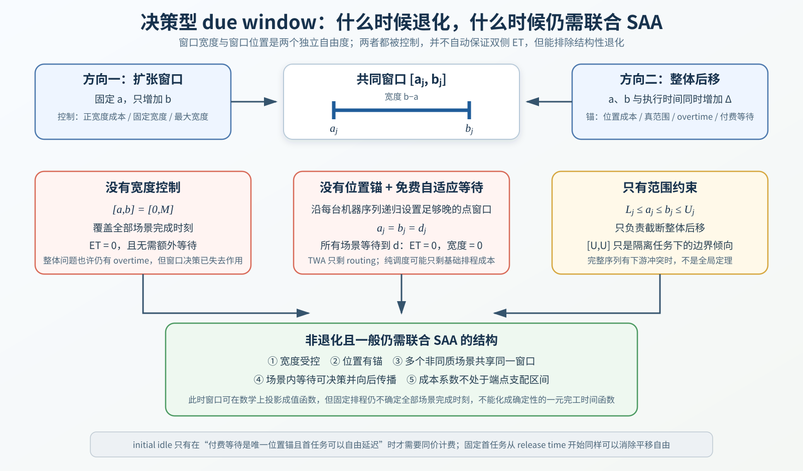
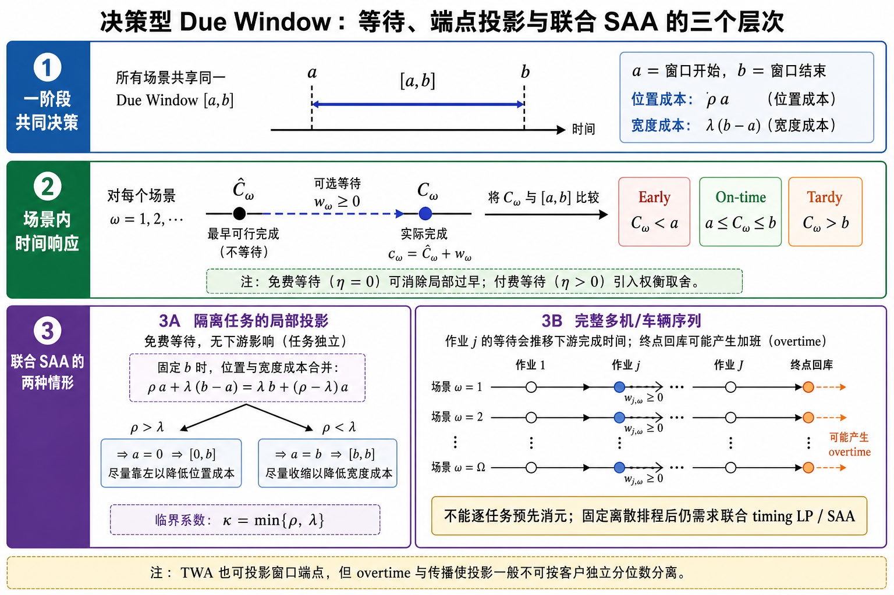

# 决策型 due window 的非退化条件与 SAA 必要性：修订分析

本文重新整理当前随机并行机 due-window assignment 问题的设定，重点不再是“窗口端点能不能写成分位数”，而是回答两个更基础的问题：什么成本或约束真正阻止模型退化；在什么设定下，固定任务分配与顺序以后仍必须联合处理多个场景，而不能像一部分确定性 DDA 文献那样，把 due date/window 消掉后直接得到一个简单的一元完工时间函数。

需要先修正此前两处表述。第一，范围约束并不在完整机器序列上推出每个任务都取 $[U_j,U_j]$；这只是隔离任务、免费等待、无位置成本且点窗口可行时的边界结论。第二，initial idle 不是无条件必须收费。只有当付费等待是模型唯一的位置锚、同时首任务又可以自由延迟时，免费的 initial idle 才会绕过该位置锚；把每台启用机器的首任务固定在最早可行时刻，同样能消除这一自由度，而且通常更符合机器调度语义。

## 1. 统一模型与符号

任务 $j$ 的第一阶段共同承诺窗口记为 $[a_j,b_j]$，其中 $a_j$ 是窗口起点，$b_j$ 是窗口终点，$b_j-a_j$ 是窗口宽度。$Omega$ 是有限场景集，$p_\omega$ 是场景概率。$C_{j\omega}$ 是场景 $\omega$ 下包含主动等待后的实际完工时刻，$I_{j\omega}$ 是为了调整执行时刻而插入的可控 idle。定义

$$
E_{j\omega}=(a_j-C_{j\omega})^+,
\qquad
T_{j\omega}=(C_{j\omega}-b_j)^+.
$$

用 $\alpha_j,\beta_j,\rho_j,\lambda_j,\eta_j$ 分别表示 earliness、tardiness、窗口位置、窗口宽度和主动等待的单位成本。若考虑机器班次或车辆 shift，再用 $R_{m\omega}$ 表示机器或车辆的最终结束时刻，$H_m$ 表示正常时限，$\psi_m(R_{m\omega}-H_m)^+$ 表示 overtime。一个覆盖当前候选设定的目标可以写成

$$
\begin{aligned}
\min\quad &c(x)
+\sum_j\bigl[\rho_j a_j+\lambda_j(b_j-a_j)\bigr]\\
&+\sum_{\omega\in\Omega}p_\omega
\left[
\sum_j\bigl(\alpha_jE_{j\omega}+\beta_jT_{j\omega}+\eta_jI_{j\omega}\bigr)
+\sum_m\psi_m(R_{m\omega}-H_m)^+
\right],
\end{aligned}
$$

其中 $x$ 表示任务分配和排序决策，$c(x)$ 表示与当前研究有关的基础排程成本。本文讨论的是上述成本项中哪些可以删除、哪些不能同时删除，并不要求最终模型把全部成本都放进去。

图中必须区分三个层次：$[a,b]$ 是所有场景共享的一阶段承诺；$\widehat C_\omega$ 是场景内不主动等待时的最早可完工时刻，$C_\omega$ 是加入等待后的实际完工时刻；逐任务局部等待可以分析成本方向，但完整多机或车辆序列仍需保留下游传播与 terminal overtime。

## 2. 先区分两个完全不同的自由度

窗口退化问题容易混乱，是因为“宽度”和“位置”经常被放在同一个线性式 $\rho_j a_j+\lambda_j(b_j-a_j)$ 中讨论。在原始二维窗口空间中，它们控制的是两个不同方向；但在“隔离任务、免费等待、先优化掉左端点”的投影问题中，二者会发生替代，并合并成一个有效右端点价格。前者用于判断模型缺少哪一种控制，后者用于判断给定成本系数会形成什么窗口形态，二者不能混为同一层次。

第一是窗口扩张。固定 $a_j$，只把 $b_j$ 增加一单位，窗口宽度增加一单位，直接成本增加 $\lambda_j$。正宽度成本、固定宽度或最大宽度约束都在控制这个方向。

第二是窗口整体后移。把 $a_j$ 和 $b_j$ 同时增加一单位，宽度不变，宽度成本完全不变，直接位置成本只增加 $\rho_j$。有限日历范围、紧的 terminal overtime、付费等待以及正位置成本都可能控制这个方向。

因此，overtime 不能替代 width cost，width cost 也不能替代位置锚。前者主要惩罚为了追逐较晚窗口而推迟整条时间线，后者惩罚把窗口本身做得过宽。把

$$
\rho_j a_j+\lambda_j(b_j-a_j)
=(\rho_j-\lambda_j)a_j+\lambda_jb_j
$$

展开以后，$a_j$ 前面的系数虽然是 $\rho_j-\lambda_j$，但这只是“固定 $b_j$、单独增加 $a_j”这一缩窄操作的边际成本；它不是窗口整体后移的成本。判断位置是否有作用时，应看平移 $a_j\leftarrow a_j+\Delta,b_j\leftarrow b_j+\Delta$，该方向的边际成本始终是 $\rho_j\Delta$。

## 3. 两类真正的结构性退化

### 3.1 没有任何宽度控制

如果 $\lambda_j=0$，同时没有固定宽度、最大宽度、离散时段或服务水平约束，那么对有限 SAA 样本可以直接取

$$
a_j=0,
\qquad
b_j\ge \max_{\omega\in\Omega}C_{j\omega}.
$$

这会使该任务所有场景的 ET 都为 0，而且不需要为了窗口额外等待。即使模型中仍有 overtime，整体问题可能仍然是一个随机排程或随机路径问题，但 due-window assignment 已经失去作用。因此，对连续可变宽度的 DIF window，必须存在下列控制方式中的至少一种：正宽度成本、固定宽度、最大宽度、有限的候选时段集合，或等价的服务精度约束。文献中不一定都使用线性 width cost，但通常会用某种结构限制替代它。

### 3.2 没有位置锚，并允许免费场景等待

现在假设宽度有正成本，但 $\rho_j=0$，没有有限承诺范围，没有 terminal overtime，等待也免费。对任意固定机器序列和有限场景集，可以在每台机器上沿序列递归选择足够晚的共同目标时刻 $d_j$，使每个目标都晚于所有场景下前序任务到当前任务所需的最坏传播时间。随后令

$$
a_j=b_j=d_j,
$$

并让较快场景等待到 $d_j$。这样所有任务、所有场景的 ET 和窗口宽度都为 0。多机器不会消除这一构造，只需在每台机器上分别递归设置目标时刻。

所以，“多个场景共享同一个窗口”本身不是位置锚。共同窗口只要求各场景最后汇合到同一承诺区间；如果每个场景都可以免费等待，而且绝对时间可以无限后移，场景协同反而使同步构造成立。纯机器问题若没有其他排程成本，可能出现大量同价的分配与顺序；TWA 中则退化为只优化 routing cost。

## 4. 范围约束不会一般性推出 $[U_j,U_j]$

考虑

$$
L_j\le a_j\le b_j\le U_j.
$$

它首先是一种绝对位置锚：窗口不能再无限后移。若 $U_j$ 是真实客户承诺上限、产品 lead-time 上限或班次日历边界，它有清楚的业务含义；若 $U_j$ 只是一个很大的数值截断，它只有数值作用，通常不会改变最优解。

此前“范围加免费等待经常直接得到 $[U_j,U_j]$”把隔离任务结论误写成了完整调度结论。对一个不影响下游的隔离任务，若 $\rho_j=0$、等待免费、$\lambda_j>0$、点窗口允许，则固定 $d\in[L_j,U_j]$ 后可以等待消除 earliness，目标只剩

$$
\beta_j\sum_\omega p_\omega(\widehat C_{j\omega}-d)^+,
$$

它关于 $d$ 单调不增。因此 $d=U_j$ 确实是一个最优选择；若在某个更小的 $d$ 以后 tardiness 已经为 0，则到 $U_j$ 之间可能是一段平坦最优区间，$[U_j,U_j]$ 也不唯一。

但完整机器序列中，等待任务 $j$ 会推迟后续任务，不同任务的 $U_j$ 也可能与机器顺序不一致。把当前任务推到 $U_j$ 可能制造更大的下游 tardiness、waiting 或 terminal cost，因此不能推出所有任务都取 $[U_j,U_j]$。正确结论应是：范围约束能截断无限后移；在免费等待、无其他位置代价时，它会产生向右边界移动的局部倾向，但是否到达边界由完整序列的联合 timing 决定。

范围约束也不能替代宽度控制。若宽度免费，模型仍可能取最宽的 $[L_j,U_j]$ 来消除 ET。因而比较稳妥的范围模型应使用“真实范围 + 正宽度成本”，或“真实范围 + 固定/最大宽度”。

## 5. initial idle 到底需不需要计费

答案不是“必须计费”，而是取决于它在模型中是不是一个可以主动选择的免费平移变量。

若付费 waiting 是唯一的位置锚，但每个场景又可以在首任务前任意免费空闲，那么每台机器、每个场景至少拥有一个免费的整体平移量。它可以先把整条序列向后移动，再只为剩余的任务间相对调整支付 waiting cost。对单任务而言，这甚至能完全绕过 waiting cost；对多任务而言，它通常不能消除不同场景累计加工时间的全部相对差异，但会使绝对窗口位置不可识别，并削弱 waiting cost 的锚定作用。

这并不要求虚构“机器不工作成本”。有三种等价但业务含义不同的处理方式：

1. 固定每台启用机器的首任务在该机器的最早可行时刻或 release time 开始。此时 initial idle 不是决策，也不需要计费；内部主动 idle 仍完全允许。
2. 允许首任务主动延迟，并把这部分可控 idle 与任务间 idle 同价计费。不可避免的 release waiting 不计费。
3. 保留免费的 initial idle，但另用正位置成本、真实日历范围或 terminal overtime 锚定绝对时间。

如果实际系统没有明确的日历原点，所有时刻只表示相对时间，那么整体平移不影响业务，直接固定首任务从 0 开始是最干净的规范化。当前机器调度问题没有强烈的 overtime 语义，因此推荐采用这种方式，而不是为了数学有界性给机器增加不自然的加班成本。

## 6. 给定完成时间后的局部窗口关系

为了判断系数是否把窗口强行推到某种边界，先固定任务 $j$ 在所有场景下的实际完工时刻，忽略上下界和等待传播，考虑窗口投影子问题

$$
\min_{a\le b}
\left\{
\rho a+\lambda(b-a)
+\alpha\sum_\omega p_\omega(a-C_\omega)^+
+\beta\sum_\omega p_\omega(C_\omega-b)^+
\right\}.
$$

令 $F$ 为这些场景完工时刻的加权经验分布。以下分位条件假设 $\alpha>0,\beta>0$；当某一系数为 0 时，应直接按相应的单侧边界问题处理。当两个端点都处于内部且 $a<b$ 时，最优性条件为

$$
F(a^-)\le q_a\le F(a),
\qquad
q_a=\frac{\lambda-\rho}{\alpha},
$$

$$
F(b^-)\le q_b\le F(b),
\qquad
q_b=1-\frac{\lambda}{\beta}.
$$

这两个经验分位水平只用于分析给定完成向量下的窗口结构，不用于构造当前 Benders 算法。真正可直接用于预处理的是第 7.1 节给出的三个全局占优关系。

| 系数区间 | 窗口结构倾向 | 含义 |
|---|---|---|
| $\rho\ge\lambda$ | $a$ 落到允许的下界 | 增加起点的直接成本不低于缩窄窗口的收益，early 一侧容易退出 |
| $\lambda\ge\beta$ | $b$ 被压低，常与 $a$ 合并 | 扩宽一单位的成本不低于最多可减少的一单位 tardiness 成本 |
| $q_a\ge q_b$ | $a=b$ | 两个无约束分位点交叉，正宽窗口收缩成 due date |
| $0<q_a<q_b<1$ | 两个不同的内部经验分位点 | 给定完成向量下存在真正的双端点权衡，但只是局部形态描述 |

因此，不再根据内部双分位点条件为全部任务设计统一参数区间。$\rho<\lambda$ 本身没有一般占优结论，位置成本仍然控制窗口整体后移；最终是内部窗口还是点窗口，还要看 $\alpha,\beta$、该任务的完成时间向量和其他成本。特别地，若进一步满足第 7.1 节的 $\lambda>\beta$ 或 $\lambda>\rho+\alpha$，仍会全局保证最小宽度。

如果 $q_a\ge q_b$，点窗口并不等于模型完全退化。此时窗口变成可决策 due date $d$，其内部经验分位水平为

$$
F(d^-)\le \frac{\beta-\rho}{\alpha+\beta}\le F(d),
$$

前提是该水平位于 $[0,1]$。问题仍可能是非平凡的随机 due-date assignment，只是“窗口宽度”这一研究对象消失了。

### 6.1 免费等待下，$\rho<\lambda$ 何时真的推出点窗口

当前所有候选模型始终允许等待，不再讨论“不允许等待”的版本。考虑一个已有可行解：若任务 $j$ 在场景 $\omega$ 下提前完成，即 $E_{j\omega}>0$，就在该任务加工前再增加不超过 $E_{j\omega}$ 的等待。这样会把实际完成时刻推迟同样的数量，并减少相同数量的 earliness。

在免费等待版本中，只有当这部分延迟不增加任何下游或 terminal cost 时，才能无代价地把该任务的 earliness 完全消除。该条件自动成立的典型情形是：任务 $j$ 是所在机器的最后一个任务，模型又没有 makespan、overtime 等终端时间成本；对非终端任务则一般不成立，因为等待会推迟后续任务。

只有在上述零下游边际成本条件成立、且点窗口允许时，固定 $b_j$ 后才只剩

$$
\rho_ja_j+\lambda_j(b_j-a_j)
=\lambda_jb_j+(\rho_j-\lambda_j)a_j.
$$

因此，$\rho_j<\lambda_j$ 时得到 $a_j=b_j$，$\rho_j>\lambda_j$ 时得到 $a_j=0$。这不是所有任务都满足的全局性质：免费等待下可以对机器末任务使用，或者在求解后检查某个非终端任务的延迟是否完全被下游空闲吸收，但不能在求解前据此把全部窗口固定为点窗口。

## 7. $\alpha$、$\eta$ 和允许等待的关系

模型中真正的 earliness 定义为

$$
E_\omega=(a-C_\omega)^+,
$$

其中 $C_\omega$ 是场景 $\omega$ 下包含全部等待后的实际完工时刻，$\alpha E_\omega$ 是早完工成本；$\alpha$ 是每单位 earliness 的价格，例如库存、保管、提前交付或客户不便成本。

模型始终允许增加主动等待。对某个已有可行解，若 $E_\omega>0$，增加 $\Delta\le E_\omega$ 的等待会使本任务的 early cost 减少 $\alpha\Delta$，直接 waiting cost 增加 $\eta\Delta$。如果该任务后面还有其他任务，还要加上由这次延迟引起的下游成本变化。因此，只有对机器末任务或下游完全不受影响的情形，才可以只比较 $\eta$ 与 $\alpha$；完整 SAA 中始终保留 $\alpha E+\eta w$，不作系数替换。

### 7.1 真正有用的全局成本占优关系

下列关系按任务 $j$ 分别判断，不要求所有任务共享同一个 $\rho/\lambda$。

第一，给定实际完成时间向量，若

$$
\rho_j\ge\lambda_j,
$$

则固定右端点 $b_j$ 时，提高左端点 $a_j$ 的直接成本变化为 $\rho_j-\lambda_j\ge0$，同时还不会减少 earliness。因此一定存在最优解令 $a_j$ 取允许下界；若下界为 0，则 $a_j=0$，位置成本项消失，剩余窗口成本等价为 $\lambda_jb_j$。这时可以说位置成本被宽度成本占优，该任务的左端点可以预处理固定。

若 $\rho_j<\lambda_j$，则一般不能仅凭两者关系确定 $a_j$：提高 $a_j$ 会节省宽度成本，但可能增加 earliness，最终位置取决于完成时间分布和其他成本。只有在“点窗口允许且 early 已被免费等待完全消除”的局部模型中，才严格得到 $a_j=b_j$，即 due window 收缩为可决策 due date。

第二，假定场景概率已归一化为 $\sum_\omega p_\omega=1$。给定 $a_j$ 和实际完成时间向量，右移 $b_j$ 一单位需要支付 $\lambda_j$，而最多只能在所有场景都迟到时节省 $\beta_j$ 的期望 tardiness 成本。因此，若

$$
\lambda_j>\beta_j,
$$

则扩大右端点严格不划算，最优解取最小可行宽度：点窗口允许时为 $b_j=a_j$，有最小宽度 $D_j^{\min}$ 时为 $b_j=a_j+D_j^{\min}$。若 $\lambda_j=\beta_j$，取最小宽度仍然最优，但可能存在平坦的并列最优区间；若 $\lambda_j<\beta_j$，是否扩宽取决于晚于当前 $b_j$ 的场景比例，不能仅由两个系数确定。

第三，还可以从左侧缩窄窗口。固定 $b_j$ 和全部排程、等待变量，把 $a_j$ 向右移动一单位：宽度成本减少 $\lambda_j$，位置成本增加 $\rho_j$，earliness 成本最多增加 $\alpha_j$。因此，若

$$
\lambda_j>\rho_j+\alpha_j,
$$

则从左侧缩窄窗口始终严格改善目标，最优窗口也必取最小宽度。这个条件与 $\lambda_j>\beta_j$ 分别表示从左侧或右侧缩窄都形成占优；任一条件成立都足以保证点窗口，若规定最小宽度，则保证宽度等于该下界。

综上，下面三类结论对完整模型成立，而且证明时只是固定已有排程和等待决策、修改窗口端点，并没有禁止等待：

| 参数条件 | 必然结果 |
|---|---|
| $\rho_j>\lambda_j$，且左端点下界为 0 | $a_j=0$，所以该任务所有场景的 earliness 恒为 0 |
| $\lambda_j>\beta_j$ | 从右侧压缩，窗口取最小宽度 |
| $\lambda_j>\rho_j+\alpha_j$ | 从左侧压缩，窗口取最小宽度 |

等号情形下一定存在具有相应边界结构的最优解，但可能同时存在其他并列最优解。除此之外，分位数关系主要用于解释最优窗口形态，不会把当前含场景等待传播的联合 SAA 简化成确定性调度问题。

### 7.2 哪些情形必然没有 earliness

第一，若 $\rho_j>\lambda_j$ 且时间下界为 0，则全局占优关系直接给出 $a_j=0$；由于实际完成时刻非负，$E_{j\omega}=(a_j-C_{j\omega})^+=0$，与 waiting 免费还是付费无关。

第二，对机器末任务，若没有终端时间成本且 $\eta_j<\alpha_j$，任何正 earliness 都可以通过增加等待严格降低成本，因此最优解必有 $E_{j\omega}=0$；$\eta_j=\alpha_j$ 时至少存在一个无 earliness 的最优解。免费等待是 $\eta_j=0$ 的特殊情形。

第三，对非终端任务，$\eta_j<\alpha_j$ 本身不够，因为增加等待可能制造下游 tardiness。若一定要给出只依赖参数的保守充分条件，在没有 overtime 或 makespan 成本时，可以要求

$$
\alpha_j>
\eta_j+\sum_{k\ne j}\beta_k.
$$

右侧用所有其他任务的 tardiness 系数上界代替未知的同机后续任务集合。该条件足以让消除任务 $j$ 的一单位 earliness 在最坏传播情况下仍然有利，但通常过强，只适合作为理论边界，不建议用于算例标定。

对机器末任务还可以把点窗口条件进一步收紧。由于这时 waiting 不传播，优化 waiting 后的有效 early 单价为 $\min\{\alpha_j,\eta_j\}$；因此

$$
\lambda_j>\rho_j+\min\{\alpha_j,\eta_j\}
$$

就足以从左侧把窗口压到最小宽度。免费等待时 $\eta_j=0$，该条件退化为 $\lambda_j>\rho_j$。于是末任务在无 terminal cost 的免费等待版本中形成明确二分：$\rho_j<\lambda_j$ 时窗口收缩为点，$\rho_j>\lambda_j$ 时左端点落到 0，等号时可能并列。因此，它不能仅靠位置、宽度和 ET 三项稳定形成“左端点大于 0 且宽度大于 0”的内部窗口。

若希望付费等待版本至少保留内部双端点窗口的可能性，逐任务应避免三个支配区间，即要求

$$
\rho_j<\lambda_j<\beta_j,
\qquad
\lambda_j<\rho_j+\min\{\alpha_j,\eta_j\}.
$$

这些只是避免窗口被参数关系必然推到边界的必要检查，不保证最终一定得到内部窗口；场景完成时间分布和序列传播仍会决定实际解。

### 7.3 单任务占优与整个模型退化必须分开

$\lambda_j>\beta_j$ 与 $\lambda_j>\rho_j+\alpha_j$ 都是与场景分布、排程和 waiting 决策无关的逐任务充分条件。设当前窗口比最小宽度多 $\Delta>0$。从右侧减小 $b_j$ 时，宽度成本减少 $\lambda_j\Delta$，每个场景的 tardiness 最多增加 $\Delta$，所以期望 tardiness 成本最多增加 $\beta_j\Delta$；若 $\lambda_j>\beta_j$，原窗口不可能最优。从左侧提高 $a_j$ 时，宽度成本同样减少 $\lambda_j\Delta$，位置与 earliness 成本最多增加 $(\rho_j+\alpha_j)\Delta$；若 $\lambda_j>\rho_j+\alpha_j$，也必然继续压缩到最小宽度。随机场景不会破坏这两个证明，因为它们使用的是 hinge loss 每移动一单位至多变化一单位以及 $\sum_\omega p_\omega=1$。

但这两条首先只是任务级结论。令

$$
\mathcal J_{\min}=\{j:\lambda_j>\beta_j\ \text{或}\ \lambda_j>\rho_j+\alpha_j\}.
$$

只有 $\mathcal J_{\min}=\mathcal J$ 时，全部窗口才必然退化为 due date 或规定的最小宽度；若只包含少量任务，只能固定这些任务的一个窗口自由度，其他任务的窗口、场景 timing 和排程仍需联合优化。即使全部窗口均为点，模型通常也只是变成随机 due-date assignment，并不会自动变成确定性调度。类似地，$\rho_j>\lambda_j$ 只会让对应任务满足 $a_j=0$ 并消除其 earliness；只有该关系覆盖全部任务时，early 目标才从整个模型中系统性退出。

因此，理论模型可以保留一般正成本并完整分析这些边界；主数值实验则应避免实例被占优关系预先决定。对“位置成本 + 宽度成本”主模型，可按任务采用带正裕量的条件

$$
\rho_j<\lambda_j,
\qquad
\lambda_j<\beta_j,
\qquad
\lambda_j<\rho_j+\alpha_j.
$$

第一条避免 $a_j=0$ 的全局占优，后两条避免从右侧或左侧必然压成最小宽度。它们只排除必然边界，不保证每个任务最终都有正 earliness、tardiness 和正宽度。若将 $\rho_j,\lambda_j,\beta_j$ 从相同连续分布中彼此独立生成，则 $\Pr(\rho_j>\lambda_j)=\Pr(\lambda_j>\beta_j)=1/2$，会天然制造大量边界任务，因而不适合作为唯一的主实验生成方式。可以另保留一个不加条件的 stress 组，用于检验算法对混合边界结构的表现。

机器末任务的 $\eta_j<\alpha_j$ 不属于同一层面的全局退化。末任务由排程内生决定，通常每台启用机器至多一个；当任务数远大于机器数时，受影响任务比例至多约为 $m/n$，并且不能提前按固定任务直接消元。它仍可能影响优化器选择谁作为末任务，但对整体算法结构的简化通常有限，所以没有必要仅为避开这一局部现象强制设置 $\eta_j\ge\alpha_j$。数值结果中单独报告末任务的 earliness/waiting 状态即可；只有在 $m$ 与 $n$ 同量级时，这一影响才可能不再局部。

### 7.4 加入窗口位置区间和长度界以后

设窗口还必须满足

$$
L_j\le a_j\le b_j\le U_j,
\qquad
D_j^{\min}\le b_j-a_j\le D_j^{\max},
$$

并假定 $D_j^{\min}\le D_j^{\max}\le U_j-L_j$，从而可行域非空。这些约束不会改变第 7.1 节三个占优关系的移动方向，但会改变移动最终停在哪个边界。

当 $\rho_j>\lambda_j$ 时，固定 $b_j$ 并降低 $a_j$ 始终改善目标，直到

$$
a_j=\max\{L_j,\ b_j-D_j^{\max}\}.
$$

因此，如果没有有限最大宽度，结论就是 $a_j=L_j$；如果最大宽度先被碰到，则得到 $b_j-a_j=D_j^{\max}$。只有 $L_j=0$ 且最大宽度不阻挡左移时，才能继续推出 $a_j=0$ 和 earliness 恒为 0。也就是说，$\rho_j>\lambda_j$ 仍然保证左侧边界必有一个激活，但不一定还是原来的 $a_j=0$。

当 $\lambda_j>\beta_j$ 时，从右侧减小 $b_j$ 的改善方向不变；当 $\lambda_j>\rho_j+\alpha_j$ 时，从左侧提高 $a_j$ 的改善方向也不变。两种情况下最终都得到

$$
b_j-a_j=D_j^{\min}.
$$

所以，位置区间、最大宽度和正的最小宽度不会推翻这两条结论，只会把“点窗口”改成“最小允许宽度窗口”。但若一开始就规定固定长度 $b_j-a_j=\bar D_j$，宽度已经不是决策，$\lambda_j\bar D_j$ 是常数；此时两个关于 $\lambda_j$ 的压缩结论没有对象，不能再作为模型性质或预处理贡献。

## 8. 三类候选设定及参数控制

### 8.1 位置成本 + 宽度成本，不设 overtime

这一设定有明确文献基础，也足以替代 TWA 中的 overtime。$\rho_j>0$ 控制窗口整体后移，$\lambda_j>0$ 控制窗口扩张，所以不会出现“零宽点窗口无限后移且 ET 全为 0”的免费构造。机器没有班次语义时，这是比人工 overtime 更自然的承诺报价模型：承诺越晚，位置成本越高；承诺越宽，精度成本越高。

如果等待免费，该模型仍可能使 earliness 很少，并按照每个任务自身的 $\rho_j$ 与 $\lambda_j$ 关系形成点窗口或下界窗口。若等待付费，则直接 waiting cost 与下游传播共同决定是否等待；$\eta_j$ 应按主动 idle 的业务代价设定，而不是为了制造正 earliness 人为要求它大于 $\alpha_j$。

这一设定没有参数无关的全局退化：只要 $\rho_j,\lambda_j>0$，窗口无限后移和无限扩宽都需要付费。需要避免的是第 7.3 节的任务级支配区间在主算例中覆盖过多任务。采用条件生成后，随机性仍通过多场景完成时刻、等待传播和共同窗口进入联合 SAA；窗口端点不会被预先确定。

主数值实验建议使用带裕量的 $\rho_j<\lambda_j<\beta_j$ 和 $\lambda_j<\rho_j+\alpha_j$。$\rho_j<\lambda_j$ 是为了避免左端点必落下界，$\lambda_j<\beta_j$ 是为了避免从右侧必取最小宽度，$\lambda_j<\rho_j+\alpha_j$ 是为了避免从左侧必取最小宽度。它们不是模型成立的必要条件，只是主算例避免被参数预先决定的生成条件；理论分析仍保留全部一般参数区间。

### 8.2 真实范围 + 宽度控制

这一设定也可行。范围负责绝对位置，正 width cost 或最大宽度负责服务精度，因此不必再设置位置成本或 overtime。它的优势是参数具有直接业务解释，缺点是结果可能高度依赖人为边界。若 $U_j$ 很松，范围基本不起作用；若 $[L_j,U_j]$ 很窄，求解难度和 ET 主要由边界强制产生，而不是由窗口成本权衡产生。

所以范围模型最好只在能说明 $L_j,U_j$ 来源时作为主模型。若目前没有真实范围，可把它作为第二种问题设定，与“位置成本 + 宽度成本”比较，而不要为了防退化随意生成很窄的窗口域。

该模型没有位置成本，即可按 $\rho_j=0$ 检查第 7.1 节：$\lambda_j>\beta_j$ 或 $\lambda_j>\alpha_j$ 都会保证最小宽度。若希望主算例保留宽度决策，应至少令 $\lambda_j<\min\{\alpha_j,\beta_j\}$。范围本身不会必然推出 $[U_j,U_j]$；只有在免费等待、等待无下游代价且上界足够宽松等局部条件下才容易出现这种边界。真正需要控制的是范围松紧：过松可能让 ET 大量归零，过紧则会由边界替代成本权衡。

因此该设定需要控制两类量。第一是相对成本，使用 $\lambda_j<\min\{\alpha_j,\beta_j\}$ 避免宽度必取下界；第二是区间松紧，使 $[L_j,U_j]$ 与无等待完成时间分布有适度重叠，避免所有任务都轻易等待到上界，也避免绝大多数场景天然落在区间外。这里不存在一个只靠成本系数就能保证内部窗口的充分条件，范围必须结合实例时间尺度标定。

### 8.3 宽度成本 + 二阶段 waiting cost，不设位置成本、范围和 overtime

这一候选设定就是付费 waiting 版本，即 $\eta_j>0$；免费 waiting 且没有位置锚的情形不属于候选模型。窗口后移没有直接位置成本，而是通过为了履行较晚承诺所需的主动等待间接付费。

当 $\eta_j>0$ 时，窗口后移会迫使较快场景支付等待，waiting cost 才能提供位置斜率；同时必须固定首任务的最早开始，或者把 initial idle 也计入 waiting cost，防止整台机器免费平移。该模型没有位置成本，所以 $\lambda_j>\beta_j$ 或 $\lambda_j>\alpha_j$ 仍会全局保证对应任务取最小宽度，主算例同样应采用 $\lambda_j<\min\{\alpha_j,\beta_j\}$。对末任务还存在更紧的局部条件 $\lambda_j>\min\{\alpha_j,\eta_j\}$，但因末任务身份内生且数量有限，不把它作为主算例的统一排除条件。

该设定还需要给 $\eta_j$ 设置严格正的下界。$\eta_j$ 很小不会产生数学上的免费退化，但会使模型接近免费 waiting，出现大量 waiting 和很少的显式 earliness；因此主实验可设置低、中、高三个 waiting 价格档位，而不必统一强制 $\eta_j\ge\alpha_j$。若希望连末任务的点窗口倾向也尽量减少，可额外令 $\lambda_j<\min\{\alpha_j,\eta_j,\beta_j\}$，但这只是更严格的实验控制，不是主模型成立所必需。

若首任务开始不固定、首任务之前的 initial idle 又不计价，则该模型首先出现的是绝对位置平移不唯一，而不是一般意义上“所有 earliness 必为 0”。对某台机器及任意 $K\ge0$，把该机器全部任务和窗口同时平移：

$$
C'_{j\omega}=C_{j\omega}+K,
\qquad
a'_j=a_j+K,
\qquad
b'_j=b_j+K,
$$

同时把首任务前空闲增加 $K$。窗口宽度、各任务 ET、相邻任务之间的 waiting 和目标值全部不变，因此存在任意晚的一族等价最优解，窗口绝对位置无法识别。单场景且窗口完全可决策时，确实还可以把点窗口放到实际完工时刻使 ET 为 0；但在多场景 SAA 中，各场景相对完工间隔不同，单纯整体平移不会改变这些相对差异，所以不能据此断言全部 earliness 必为 0。需要排除的是免费平移自由度。

#### 8.3.1 Tan and Fu (2024) 怎样定义 idleness cost

与这一设定最接近的论文是 Tan and Fu 的 *Just-in-time scheduling problem with affine idleness cost*，发表于 EJOR 313 (2024) 954--976，DOI 为 `10.1016/j.ejor.2023.08.038`；论文 2023 年在线，并非 2025 年。它研究确定性单机、任务特定且外生给定的 due date。任务 $j$ 的准时成本为

$$
f_j(C_j)=\alpha_j(d_j-C_j)^++\beta_j(C_j-d_j)^+.
$$

若序列中相邻任务 $Q_k,Q_{k+1}$ 之间的空闲为

$$
x_k=C_{Q_{k+1}}-p_{Q_{k+1}}-C_{Q_k}\ge0,
$$

论文设置仿射空闲成本

$$
g(x_k)=a x_k+b\mathbf 1\{x_k>0\},
\qquad a,b>0,
$$

其中 $a$ 给空闲持续时间定价，$b$ 是一旦出现正空闲就支付的固定成本。总目标为

$$
\min_{Q,C}
\left\{
\sum_{k=1}^n f_{Q_k}(C_{Q_k})
+\sum_{k=1}^{n-1}g(x_k)
\right\}.
$$

该文明确只计算相邻任务之间的 $n-1$ 个 idle gaps，不计算首任务之前和末任务之后的空闲。它同时规定所有任务在外生区间 $[\sigma,\tau]$ 内加工，但首任务可以晚于 $\sigma$ 开始而不单独支付 initial-idle cost。这个设定不会产生本文所说的免费平移退化，因为 Tan and Fu 的 $d_j$ 是固定参数；整体后移任务而不移动 due date 会增加 tardiness。我们的 due window 是决策变量，可以与排程一起平移，所以若想让 waiting cost 单独替代位置成本，就必须额外固定首任务开始，或把 dummy origin 到首任务的间隔也纳入 waiting cost。

Tan and Fu 对 $a,b$ 的现实解释也可直接借鉴：线性部分可表示空闲状态的能耗、人工或外部资源租赁时间；固定部分可表示停机后再次启动、重新设置或重新加热的成本。其两任务分析表明，较大的 $a,b$ 会促使连续加工，而较大的 ET 单价会使保留空闲、追求准时更划算。论文进一步把固定序列的 timing 问题用 $O(n^2)$ 的定制动态规划求解，再用遗传算法搜索序列。

对当前随机 due-window Benders 主线，建议只借鉴它的业务解释，不直接照搬固定项 $b\mathbf 1\{x>0\}$。该固定项需要额外二元变量，会把原本连续的场景 recourse 变成混合整数子问题。若希望保持 2026 风格联合 LP 子问题，最简洁的处理是对全部主动 waiting（包括 initial idle）使用线性成本 $\eta_jw_{j\omega}$；或者直接固定首任务最早开始。Sourd (2005a, 2005b) 的早期 timing 文献也主要对相邻任务间空闲计价，不能单独为可决策 due-window 模型提供绝对位置锚。

以上三种模型均不包含 overtime。后文关于两篇 TWA 的 overtime 只用于解释原论文如何锚定窗口位置，不再把它列为当前机器调度的候选设定。

## 9. 两篇 TWA 的时间、等待和成本究竟是什么

Çelik et al. (2025) 的模型 (1)–(14) 包含旅行距离、窗口宽度成本、场景期望 ET 和场景期望 overtime。车辆从给定时刻 $t_0$ 出发，约束 (8) 用

$$
w_{j\omega}\ge w_{i\omega}+t_{ij\omega}+s_j
$$

传播客户离开时刻，约束中的松弛就是可插入等待。最终 overtime 由 $w_{j\omega}+t_{j0\omega}-T$ 计算，因此旅行、服务和等待都会推迟返回时刻。该文要求窗口宽度至少为服务时间 $s_j$。

Cavaliere et al. (2026) 的模型 (1a)–(1m) 同样包含 tour cost、窗口宽度、overtime 和 ET。它明确设置 $w_{0\omega}=0$，时间传播约束 (1e) 允许等待，约束 (1g) 用最后一个客户离开时刻加返程时间计算超过 $T$ 的 overtime。该文没有另设正的窗口最小宽度约束，服务时间由传播时长口径处理，因此点窗口可行。

因此，两篇论文的总时间不是只算车辆实际移动时间。2026 从 0 开始计时；2025 从给定 $t_0$ 开始。等待虽然没有单独的 waiting-cost 项，但会进入后续访问时刻和最终返回时刻，并在超过 $T$ 后通过 overtime 付费。$T$ 之前的等待相当于使用免费班次余量，超过 $T$ 的部分才产生折线成本。

若删除 overtime，2026 模型对任意固定 tour 都可以沿访问顺序递归设置足够晚的点窗口，让所有场景等待到点，得到 ET=0、width=0，目标只剩 routing cost。2025 模型可以把每个窗口设为恰好覆盖服务过程的最小长度，得到 ET=0；宽度成本变成 $\sigma\sum_js_j$ 这一与 tour 无关的常数，因此仍只剩 routing 决策。

这说明 overtime 在原 TWA 中既有司机班次的业务含义，也承担数学上的位置锚作用。2026 第 6.2.3 节进一步指出，若 $T$ 即使存在但设得过大，最优 ATSP tour 仍可在班次内插入足够等待，使所有场景准时服务，最终只有 routing cost 相关。作者据此按基准 ATSP 时长设置 $T$，目的是避免生成时间权衡失效的实例。

但有 overtime 并不意味着 width cost 可有可无。若 width 免费，可以对不等待的最早执行时刻取足够宽的窗口，所有 ET 为 0，而且不会额外增加返回时间或 overtime。此时 due-window 决策再次失去作用，问题只剩 routing 与 overtime。除非窗口宽度固定、受最大值约束或来自离散时段集合，否则 width cost 仍然必要。

## 10. 含 overtime 的 TWA 能不能把窗口写成完工时间函数

可以在数学上投影，但不能得到确定性 DDA 文献中那种有直接算法价值的一元函数。

给定任务 $j$ 的全部场景实际完工或离开时刻向量

$$
\mathbf C_j=(C_{j\omega})_{\omega\in\Omega},
$$

可以把 $a_j,b_j$ 放进一个二维线性规划，定义其最优值

$$
\Phi_j(\mathbf C_j)=
\min_{a_j\le b_j}
\left\{
\rho_ja_j+\lambda_j(b_j-a_j)
+\sum_\omega p_\omega
\bigl[\alpha_j(a_j-C_{j\omega})^+
+\beta_j(C_{j\omega}-b_j)^+\bigr]
\right\}.
$$

窗口端点由经验分位数刻画，due-window 变量因此可以从书面模型中消去。这个结论也适用于两篇 TWA，但前提是先固定各场景的实际访问时刻；它并不允许在求解前根据外生样本直接把窗口算好。

对 Cavaliere et al. (2026) 可以写得更具体。给定客户 $j$ 在全部场景中的实际离开时刻 $w_{j\omega}$ 后，其窗口内部问题为

$$
\min_{a_j\le b_j}
\left\{
\lambda^{\mathrm{TWA}}(b_j-a_j)
+c_E\sum_\omega p_\omega(a_j-w_{j\omega})^+
+c_T\sum_\omega p_\omega(w_{j\omega}-b_j)^+
\right\}.
$$

它没有任务位置成本，所以条件分位水平为

$$
q_a=\frac{\lambda^{\mathrm{TWA}}}{c_E},
\qquad
q_b=1-\frac{\lambda^{\mathrm{TWA}}}{c_T}.
$$

该文默认宽度权重为 1，early/lateness 权重均为 10。因此，在不触发 $a_j\ge0$、$a_j\le b_j$ 等边界且固定实际离开时刻的条件下，窗口端点分别对应经验 10% 和 90% 分位点。也就是说，2026 TWA 完全可以写成条件分位数投影；论文没有把它作为算法主线，并不表示这种数学结构不存在。

Çelik et al. (2025) 也可以投影，但左、右端点对应的时间口径不同。其 $w_{j\omega}$ 是服务后的离开时刻，左端点比较服务开始时刻 $w_{j\omega}-s_j$，右端点比较离开时刻 $w_{j\omega}$，并要求 $b_j-a_j\ge s_j$。给定全部 $w_{j\omega}$ 后，窗口问题为

$$
\min_{b_j-a_j\ge s_j}
\left\{
\sigma(b_j-a_j)
+\phi\sum_\omega p_\omega
\left[(a_j-w_{j\omega}+s_j)^+
+(w_{j\omega}-b_j)^+\right]
\right\}.
$$

若最小宽度约束不额外改变端点，无约束分位水平为 $\sigma/\phi=1/3$ 和 $1-\sigma/\phi=2/3$；最终仍必须满足至少覆盖服务时长。

在上述两种条件投影中，实际访问时刻固定以后，overtime 对窗口端点而言是常数，所以不直接出现在分位数的一阶条件中。但原 TWA 并没有预先固定这些访问时刻：窗口会影响场景等待，等待会沿路线传播并改变最终返回时刻和 overtime。因此正确的嵌套关系是“给定 timing 时窗口端点是分位数；给定 route 时 timing、窗口和 overtime 仍需联合优化”。2026 的 Benders 子问题正是在联合 LP 中隐式完成这个投影，而不是先独立计算每个客户的样本分位数再固定窗口。

含 waiting 与 overtime 的完整模型可等价写成

$$
\min_{x,\,C,I,R\in\mathcal T(x)}
\left\{
c(x)+\sum_j\Phi_j(\mathbf C_j)
+\sum_\omega p_\omega
\left[\sum_j\eta_jI_{j\omega}
+\sum_m\psi_m(R_{m\omega}-H_m)^+
\right]
\right\}.
$$

但固定 $x$ 后，$C_{j\omega}$ 仍不是常数。它取决于每个场景下所有前序任务的加工时间和等待决策，等待又会传播到下游并影响 terminal overtime。因此 $\Phi_j$ 是一个多场景向量函数，外面仍有联合 timing LP。进一步把所有 $C,I,R$ 投影掉，只会得到只关于 $x$ 的联合值函数 $Q(x)$，也就是 projected Benders 要近似的对象。

确定性 DDA 能形成强结构，是因为固定顺序后每个任务通常只有一个确定完工时刻，窗口投影可化为 $f_j(C_j)$，进而导出 no-idle、排序规则、DP 或其他结构。Yue and Zhou (2021) 的随机模型也明确假设单机无 idle；固定顺序后累计加工时间的均值和方差由顺序确定，在正态分布或只用均值—方差界时，窗口端点和期望成本可进一步写成累计均值、标准差的函数。当前模型保留场景自适应等待，破坏了这一关键前提。

所以，分位数投影对当前问题仍有三个作用：解释成本系数、识别退化区间、检查求得窗口是否满足最优性；但它不会把当前 SAA 变成一个简单确定性排程问题，也不应作为主算法创新点。

## 11. 什么时候一般仍必须求联合 SAA

“due-window 变量能否数学消去”和“是否仍需 SAA”是两个不同问题。只要窗口子问题是凸的，它就可以作为值函数投影；真正决定是否需要 SAA 的，是投影以后剩下的场景 timing 是否仍然联合且不可由少数统计量闭式表示。

当前问题在下列条件同时存在时，一般仍需求显式 SAA 或与其精确等价的联合场景 LP：

1. due window 是 here-and-now 决策，必须在所有非同质场景之间共享；
2. 固定任务分配和顺序以后，场景内主动等待仍是可决策变量，因而实际完成时刻并未唯一确定；
3. 等待会沿机器序列传播，不能对每个任务独立消元；
4. 窗口宽度受控，并至少存在一种有效位置锚，使 ET 不会被免费同步构造全部消掉；
5. 场景不是完全相同，也不满足可直接使用正态 location-scale 等少量统计量闭式处理的特殊结构；
6. 成本系数和实例生成不处于 $a$ 恒在下界、$a=b$ 恒成立或 $b$ 恒在上界的支配区间。

相反，以下设定会使模型简化或退化：宽度完全免费；位置完全自由且等待免费；场景完全相同；固定顺序后禁止或证明最优解不使用 idle，同时完工时间分布具有可解析结构；或者系数使所有任务的窗口必然成为同一种边界形式。最后一种情况未必使整体问题变成确定性，但会使窗口研究内容明显变薄。

## 12. 对当前项目的推荐设定

若研究目标是建立一个不需要人工 overtime、窗口确实需要决策、并保留一般联合 SAA 结构的并行机模型，建议主模型采用

$$
\min\ c(x)
+\sum_j\bigl[\rho_ja_j+\lambda_j(b_j-a_j)\bigr]
+\sum_\omega p_\omega\sum_j
\bigl[\alpha_jE_{j\omega}+\beta_jT_{j\omega}+\eta_jI_{j\omega}\bigr],
$$

其中 $\rho_j,\lambda_j>0$，$\eta_j\ge0$，不设 overtime；所有任务间主动等待都允许，每台启用机器的首任务固定在最早可行时刻。这样 width cost 控制扩张，position cost 控制窗口整体后移；$\eta_j=0$ 和 $\eta_j>0$ 分别形成免费等待与付费等待版本，不再把 $\eta_j\ge\alpha_j$ 作为主模型必须满足的条件。

$\rho_j$ 与 $\lambda_j$ 不需要在任务间保持相同，也不需要统一规定谁更大。若采用异质客户或任务，建议直接使用任务特定成本，并在求解前按第 7.1 节逐任务检查三个明确的占优区间：$\rho_j\ge\lambda_j$ 时可选择左端点下界的最优解；$\lambda_j>\beta_j$ 或 $\lambda_j>\rho_j+\alpha_j$ 时窗口必取最小宽度。其余任务保留完整窗口变量交给联合 SAA 求解，不再根据局部分位数反推全部成本系数，也没有必要专门围绕一个全局 $\rho/\lambda$ 比值组织实验。

第二种有意义的对照模型是删除位置成本，改用有业务来源的 $L_j\le a_j\le b_j\le U_j$，同时保留 width cost 与 waiting cost。它比较“价格锚”和“硬承诺域”两种机制。若没有可信范围，不建议把它作为主模型。

第三种对照模型删除位置成本和硬范围，只保留 width cost 与严格为正的二阶段 waiting cost，并固定或计费 initial idle。它比较“直接给较晚承诺定价”和“通过履约等待间接给较晚承诺定价”两种机制。当前项目不考虑 TWA 式 overtime；相关内容只作为原论文结构解释，不进入模型和数值实验。

计算实验除目标值和求解时间外，至少应报告正宽窗口比例、端点落在上下界的比例、正 earliness/tardiness/waiting 的任务比例、各时间成本占总目标的比例，以及删除 width control 或位置锚后的退化检查。不能要求每个任务都有双侧 ET，但若绝大多数算例都出现 ET=0、窗口全为点或全贴边界，就说明实例参数没有形成预期的决策权衡，应先调整设定再比较算法。

## 13. 文献证据边界

本次以 `DDA_literature_final.xlsx` 为导航，并回到代表性论文正文核对。Yue and Zhou (2021) 的模型明确使用任务特定 DIF window，目标包含 earliness、tardiness、窗口位置和窗口宽度成本，同时假设单机从时刻 0 开始、无插入 idle。Janiak et al. (2015) 的综述显示，经典 due-window scheduling 常通过固定宽度、宽度成本或宽度上下界控制窗口精度。Shabtay, Mosheiov, and Oron (2022) 的 common assignable due date/window 还同时使用位置、宽度和上界。Excel 中记录的 Yue and Wan (2016) 与 Zhang et al. (2024) 等 DIFW 工作也使用位置与宽度项，但不少确定性结论依赖同质系数和无 idle 结构，不能直接搬到当前场景自适应 waiting 模型。

### 13.1 论文怎样解释窗口宽度成本

几篇论文对 width cost 的共同解释不是“窗口本身消耗机器时间”，而是把窗口宽度视为承诺质量或客户服务水平。可以直接概括为：客户偏好较窄窗口，因为承诺更精确、便于安排后续活动；物流服务商偏好较宽窗口，因为宽窗口带来更大的执行灵活性。对应到制造场景，小窗口对客户更有吸引力，但会减少制造商的生产灵活性；大窗口更容易满足，却可能因为承诺过于模糊而导致客户流失。

Yue and Zhou (2021) 在引言中明确说明，不同窗口宽度意味着不同的运营灵活性和成本；小窗口有利于吸引客户但降低制造商的生产灵活性，大窗口更容易满足却可能造成客户流失。因此其 $\delta_j(d_j-e_j)$ 应理解为“提供模糊交付承诺的客户侧损失或商业惩罚”，而不是车间真的为每一单位窗口宽度发生一笔直接现金支出。

Çelik et al. (2025) 将提前沟通可靠时间窗视为客户服务，因为客户会依据承诺窗口安排自己的关联活动。其 $\sigma(b_j-a_j)$ 是 time-window assignment penalty，用于给较宽、较不精确的承诺定价。论文第 5.1 节说明 $\sigma=1$、ET 权重 $\phi=3$、overtime 权重 $\psi=4$ 的目的主要是平衡四类目标项、使其与 routing cost 可比，并不是由真实财务数据估计出来的单位货币成本。

Cavaliere et al. (2026) 的解释最直接：客户通常偏好较小窗口，物流服务商则为了执行灵活性偏好较大窗口；目标函数用窗口宽度、earliness 和 tardiness 表示客户满意度，用旅行和 overtime 表示运营成本。因此其宽度系数也是多目标权衡中的服务质量权重。该文默认值和灵敏度分析同样是实验标定，而不是经验估计的统一市场价格。

迁移到机器调度时，宽度成本可以解释为客户无法确定准确收货、装配、质检、人员或下游设备准备时刻所承担的不便，也可以落实成较宽承诺需要给予的报价折扣或订单流失风险。位置成本 $\rho a$ 与它刻画不同维度：$\rho a$ 惩罚“承诺得太晚”，$\lambda(b-a)$ 惩罚“承诺得太模糊”。如果研究场景完全是企业内部排程、没有外部承诺质量含义，就不应把 $\lambda$ 宣称为真实现金成本；更稳妥的做法是称为 service-level penalty，或者改用固定宽度、最大宽度或离散承诺档位。

代表性论文并没有给出“位置成本一般应高于宽度成本”或相反的统一经验规律，实际设置如下。

| 文献 | 系数层级与位置/宽度符号 | 理论中的大小关系 | 算例设置 |
|---|---|---|---|
| Yue and Zhou (2021), EJOR | 任务特定；$\gamma_j e_j+\delta_j(d_j-e_j)$ | 按每个任务的 $\gamma_j-\delta_j$ 分情况；Case 7 在 $\gamma_j\ge\delta_j$ 且 $\delta_j<\beta_j$ 时得到 $e_j^*=0$ | 第 5.1 节将 $\alpha_j,\beta_j,\gamma_j,\delta_j$ 对每个任务独立生成于 $U[1,10]$，不存在统一的全局比值 |
| Yue and Wan (2016), JORS | 实例级公共系数；$\gamma d'_j+\delta D_j$ | Lemma 9 按 $\gamma\ge\delta$ 与 $\gamma<\delta$ 分情况；给定完工时刻后，目标可退化成 $\min\{\beta,\gamma,\delta\}C_j$ 的不同分支 | 论文以结构推导和小例子为主，没有提供可作为经验标定的统一随机系数比 |
| Zhang et al. (2024), JCO | 实例级公共系数；$\gamma d_j^1+\eta D_j$ | 推导中直接出现 $\min\{\gamma,\eta\}$，与免费等待投影后的替代结构一致 | 第 6 节令 $\beta,\gamma,\eta\in U[1,10]$，并为测试困难分支附加 $\min\{\gamma,\eta\}>\beta$ |
| Çelik et al. (2025), Transportation Science | 全局权重；没有客户位置成本，$\sigma$ 为宽度权重 | 位置由固定出发时刻和 terminal overtime 间接锚定 | $\sigma=1$、ET 权重 $\phi=3$、overtime 权重 $\psi=4$ |
| Cavaliere et al. (2026), EJOR | 全局权重；没有客户位置成本，$\alpha$ 为宽度权重 | 位置由 $w_{0\omega}=0$、shift 时限 $T$ 和 overtime 间接锚定 | 默认 $\alpha=1,\beta=10,\delta=10$，分别对应宽度、overtime、ET；灵敏度取 $\alpha\in\{0.5,1,2\}$，$\beta,\delta\in\{5,10,20\}$ |

这组证据意味着，当前模型不能从文献中直接抄一个全局统一的“$\rho$ 必须大于 $\lambda$”先验。若采用任务特定系数，$\rho_j$ 与 $\lambda_j$ 的关系只对任务 $j$ 自身成立。它的主要用途是识别占优变量：$\rho_j\ge\lambda_j$ 时可固定左端点，$\lambda_j>\beta_j$ 时可固定最小宽度；其余情况下只是窗口形态趋势，对当前联合 SAA 和 Benders 分解没有直接简化作用。因此不再建议围绕统一的 $\rho/\lambda$ 或分位水平单独设计一整套参数实验。

两篇 TWA 则采用另一条路线：都使用 width cost 和 terminal overtime，没有任务特定位置成本，也没有 $L_j\le a_j\le b_j\le U_j$ 形式的外生位置范围。它们说明“width control + terminal anchor”是一种完整组合，但并不说明机器调度必须采用 overtime。

综合而言，当前问题不会因为不设机器 overtime 而缺少意义；真正必须保留的是一个宽度控制机制和一个位置锚。为了让模型一般仍需联合 SAA，而不是回到确定性 DDA 的简单完工时间函数，还必须保留共享窗口下的非同质场景、场景自适应等待和下游传播。这三者才是当前问题与确定性文献在求解结构上的根本差异。
