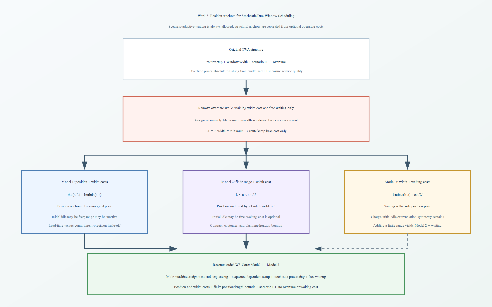

# Work 3：随机 due-window 多机调度的问题设定、非退化机制与文献依据

本文对应的原始需求与问题形成过程单独保存在：[Work 3 随机 due-window 问题设定：原始需求记录](2026-08-31-work3随机due-window问题设定原始需求记录.md)。本文给出复核、修正和文献调研后的正式结论；原始需求记录只用于追溯讨论动机。

## 1. 当前结论

Work 3 可以沿用 2025 和 2026 两篇 TWATSP-ST 的基本思路，把“客户访问顺序 + 随机旅行时间 + 可决策时间窗”改写为“机器分配与任务顺序 + 随机加工时间 + 可决策 due window”。但机器调度模型不能直接删除 TWA 中的 overtime 后保持其余设定不变。两篇 TWA 都没有任务位置成本，窗口的绝对位置主要由固定出发时刻和班次结束时间共同约束；一旦删掉 overtime，又保留免费等待和仅按窗口宽度收费，窗口就失去绝对时间锚。

当前推荐的核心问题为：考虑同质并行机、任务特定 DIF due window、随机加工时间、与机器无关但随场景变化的序列相关 setup \(s_{ij\omega}\)、场景自适应等待；一阶段共同决定机器分配、加工顺序和每个任务的 due window，二阶段按场景决定实际开始与完工时刻；目标包括确定的 setup 转换金额 \(g_{ij}\)、due-window 位置成本、宽度成本和期望 earliness/tardiness（ET）成本，不含 overtime，也不对 waiting 单独收费；同时设置任务特定的窗口位置区间和窗口长度上下界。这里把“setup 的固定项”解释为每次转换的确定金额 \(g_{ij}\)，不是固定 setup 时长；setup 持续时间 \(s_{ij\omega}\) 与加工时间 \(p_{j\omega}\) 都是随机的。另设 \(g_{ij}=0\) 的消融，区分“转换本身有固定金额”和“转换只通过随机持续时间影响 ET”两种业务口径。

这个设定同时使用了两种互补机制：位置成本在可行区间内部给较晚承诺定价，有限区间则表达不可违反的合同或客户边界。二者并非数学上都必需，但现实含义不同，合用后模型更稳定，也与前两个 work 的 due-window 设定保持连续。

图 1　从 TWA 的 overtime 锚到 Work 3 的位置成本与有限范围锚。第三种 waiting-cost 方案保留为机制对照，不进入核心模型。

## 2. TWA 删除 overtime 后为什么会退化

### 2.1 两篇 TWA 原模型的共同结构

Çelik et al. (2025) 和 Cavaliere et al. (2026) 的目标都包含四类成本：路线成本、窗口宽度成本、场景 ET 成本和驾驶员 overtime 成本。路线和窗口是一阶段决策，场景访问时刻、等待、ET 和 overtime 是连续二阶段决策。两文均允许车辆通过不等式时间递推插入等待，waiting 本身不收费；两文也都固定从 depot 出发的时间原点。

窗口宽度项代表客户服务或承诺精度，overtime 则是绝对时间的终端价格。2026 论文把路线和 overtime 归入运营成本，把窗口宽度和 ET 归入客户满意度；2025 论文的计算设置同样用独立权重平衡窗口宽度、ET 和 overtime，但这些权重是实验标度，不是经验估计的货币价格。

### 2.2 删除 overtime 后的严格结果

对于任意给定路线和有限场景集，可以沿访问顺序递归选择足够晚的共同窗口，并让较快场景等待，使各场景都在窗口内访问。此时：

1. 2026 模型只要求窗口宽度非负，因此可取点窗口，所有 ET 和宽度成本都为 0，目标只剩路线成本。
2. 2025 模型要求窗口宽度至少覆盖客户服务时间，因此可取最小宽度窗口，所有 ET 为 0，宽度项成为与路线无关的常数，目标等价于路线成本加常数。

这里不需要真的把窗口变量取成 \(+\infty\)。对每条路线都存在有限的零 ET 构造，而且还可以把窗口和相应执行时刻共同后移任意常数，形成无界的零成本平移方向。Cavaliere et al. (2026) 第 6.2.3 节正是据此说明：班次上限 \(T\) 过松时，最坏场景也能通过等待准时访问，ET 消失，实例只剩 routing cost，因此 \(T\) 必须按路线时长谨慎设置。

在机器调度中，同一构造也成立：给定每台机器的任务序列后，可以递归把任务窗口设在所有场景都能通过等待达到的位置。若没有位置成本、有限位置范围、overtime 或付费 waiting，ET 会消失，宽度取允许的最小值。此时剩下什么取决于基础模型：有序列相关 setup 成本时，问题退化为 setup/序列成本最小化；只有 setup 时间而没有其他序列成本时，甚至可能只剩常数或大量等价排程。因此，“退化成 TSP”只准确描述原车辆问题，在机器问题中应称为“退化成只含基础分配或 setup 成本的排程问题”。

## 3. 三种替代 overtime 的处理方式

### 3.1 模型一：位置成本 + 宽度成本

窗口 \([a_j,b_j]\) 的一阶段成本写为

\[
\rho(a_j-L_j)+\lambda\bigl[(b_j-a_j)-D_j^{\min}\bigr],
\]

其中 \(L_j\) 是任务 \(j\) 最早允许的窗口起点，\(D_j^{\min}\) 是合同、服务目录或验收流程已经包含的基础窗口长度。共同费率版本对同一制造商和服务等级使用 \(\rho,\lambda\)；完整异质版本则使用 \(\rho_j,\lambda_j\)。窗口整体后移一单位产生相应位置边际成本，超过基础长度后每扩张一单位产生相应宽度边际成本。只要各任务的两类费率为正，窗口整体后移和无代价扩张两个方向都受到控制。initial idle 可以免费，因为窗口与排程共同平移会增加位置成本。

位置成本相对 \(L_j\) 而不是相对时间 0 计费更合适。若直接写 \(\rho a_j\)，区间 \([0,L_j]\) 是任务根本不能选择的时间，却仍被记入成本；写成 \(\rho(a_j-L_j)\) 后，\(L_j\) 对应零基准，只有超出最早可接受承诺的部分收费。两种写法在 \(L_j\) 为常数时只差一个常数，但后者的经济解释和跨任务比较更清楚。

宽度成本同理应相对 \(D_j^{\min}\) 计费。若 \(D_j^{\min}>0\) 表示客户合同本来就允许的最小验收槽或系统不可避免的基础服务时长，则该部分不应再次产生“承诺模糊度”成本。对所有任务都必须被调度且 \(D_j^{\min}\) 固定的当前模型，减去 \(\lambda_jD_j^{\min}\) 只改变目标常数，不改变最优解、Benders cut 的斜率或此前的参数占优条件；但它使成本分项从“总窗口长度”变为“超过基础服务的额外弹性”。若以后允许拒单、选择服务档位或联合决定 \(D_j^{\min}\)，该项不再是全局常数，必须显式保留。

### 3.2 模型二：有限位置区间 + 宽度成本

对每个任务设置

\[
L_j\le a_j\le b_j\le U_j<+\infty.
\]

有限的 \(U_j\) 直接截断共同平移，因而即使没有位置成本、initial idle 免费，模型也不存在向右无限移动的方向。范围约束并不一般性推出 \([U_j,U_j]\)；它只给出可行边界，最终位置仍由宽度、ET、等待传播和其他任务共同决定。

如果模型只有范围和宽度成本，窗口可能较频繁地落在边界，但这属于有限可行域内的正常最优选择，不是退化。范围过松仍会使实例近似无锚，数值实验必须使 \(U_j\) 与任务实际完成时间尺度相匹配，而不能统一取一个几乎不生效的大 \(M\)。

### 3.3 模型三：宽度成本 + waiting cost

若不设置位置成本和有限位置范围，正的 waiting cost 可以成为窗口位置的唯一价格。内部等待和首任务前 initial idle 都按相同单位成本计费时，排程整体后移会增加 waiting cost，从而消除平移自由。

如果只对相邻任务之间的等待收费、首任务前 initial idle 免费，那么模型通常不是 ET 退化，而是存在时间平移对称：对任意 \(K\ge0\)，把某台机器上所有场景时刻和所有窗口同时增加 \(K\)，ET、宽度和内部等待都不变。因此会有无界的零成本方向和无穷多个等价 timing 解。有限窗口范围可以消除该方向，但此时模型已经成为“模型二 + waiting cost”，不再是单独检验 waiting 能否替代位置锚的纯模型三。

Tan and Fu (2024) 的 affine idleness cost 只对相邻任务之间的正 idle gap 收费，并不收费首任务之前的 idle；该论文仍有固定 due dates 和外生时间区间提供绝对时间锚，不能直接用来证明“内部 waiting cost 单独足以锚定可决策窗口”。

### 3.4 当前选择

核心模型合并模型一和模型二：保留位置成本、宽度成本、有限位置区间和长度上下界；waiting 允许但免费。模型三只作为可选消融，用于研究机器空闲运营成本是否改变窗口与排程，不作为主问题。这样既保持三种机制的理论区别，又避免把 initial idle 的收费口径变成论文主设定。

## 4. 文献依据与现实含义

本次调研采用项目综述表定位文献，再以本地全文和出版社页面核对。各来源与当前模型的关系如下。

| 来源 | 论文明确采用或说明的设定 | 对当前模型的证据边界 |
| --- | --- | --- |
| Çelik et al. (2025) | 路线、窗口宽度、场景 ET、overtime；免费 waiting；窗口至少覆盖服务时间 | 支持 TWA 基线和 2025 风格分解，不支持位置成本 |
| Cavaliere et al. (2026) | 路线、非负窗口宽度、场景 ET、overtime；免费 waiting；第 6.2.3 节分析 \(T\) 过松的退化 | 直接支持 overtime 的位置锚作用和 2026 projected Benders |
| Yue and Zhou (2021) | 随机单机、任务特定 DIFW、任务特定 ET/位置/宽度成本 | 与当前成本结构最接近，但没有多机、setup 和场景 waiting |
| Janiak et al. (2015) | due-window 位置和宽度成本；公共窗口的 \(D^{\min},D^{\max}\)；单机与并行机结果 | 支持成本及长度界传统，不等于任务特定随机 DIFW |
| Shabtay (2016) | 任务特定 due date 上界；过晚承诺可能违反先期协议 | 支持有限绝对时间范围的现实动机，原文不是 due window |
| Shabtay et al. (2022) | 公共 due date/window 的位置与长度上界；early/late work | 支持 bounded window 和 work 指标，但结构比当前模型特殊 |
| Kim and Lee (2009) | due-date assignment + sequence-dependent setup；注塑换模/清洗例子 | 支持 setup 的现实性，原文为确定性单机公共 due date |
| Zorzini et al. (2008) | 15 家意大利资本品 MTO/ETO 企业的交期报价、产能评估和接单实践 | 直接证明交期位置是接单阶段的真实决策，但没有估计位置或宽度系数 |
| Oyama et al. (2024) | 4,062 名消费者的配送日期、时间槽宽度和价格选择实验 | 证明“更早”和“更窄”可以分别估值，但电商配送估值不能直接移植到制造业 |

### 4.1 窗口宽度成本

Yue and Zhou (2021) 对随机加工时间下的任务特定 DIF due window 使用

\[
\mathbb E\!\left[\alpha_jE_j+\beta_jT_j+\gamma_ja_j+\delta_j(b_j-a_j)\right].
\]

论文的现实解释是：较窄窗口对客户更有吸引力，但降低制造商的生产灵活性；较宽窗口更容易满足，却可能造成客户流失，因此必须在客户吸引力和运营灵活性之间权衡。两篇 TWA 也有明确解释，但详细程度不同。Çelik et al. (2025) 把提前向客户沟通可靠时间窗视为提升 customer service 的手段，指出客户会根据该承诺安排其后续活动，并在结果中把窗口宽度和窗口违反共同作为服务质量指标。Cavaliere et al. (2026) 表述得更直接：客户通常偏好较小窗口，物流服务商为了执行灵活性偏好较大窗口；模型中路线和 overtime 属于 operational costs，窗口宽度、earliness 和 tardiness 属于 customer satisfaction，并可用目标权重调节运营吸引力与客户偏好。因此，宽度成本不是“使用宽窗口产生的一笔直接生产或运输现金支出”，而是较模糊承诺造成的服务价值、客户满意度或订单吸引力损失。[Çelik et al. (2025)](https://doi.org/10.1287/trsc.2024.0750) [Cavaliere et al. (2026)](https://doi.org/10.1016/j.ejor.2025.07.034)

现实量化可来自不同承诺档位的报价差、客户对 1/2/4 小时时间槽的选择率、取消或流失概率、因宽承诺支付的折扣或补偿，以及 SLA 中不同时间精度对应的价格。若有历史订单，可把“窗口每扩大一小时导致的期望贡献毛利损失”作为 \(\lambda_j\)；没有可靠数据时，\(\lambda_j\) 只能解释为标准化权重，不能声称是实际货币成本。

### 4.2 窗口位置成本

位置成本衡量把最早可接受交付承诺推迟的代价。它可以对应较长 lead time 导致的订单流失、折扣、延迟收入、客户不满意和声誉损失。Kim and Lee (2009) 对 due-date assignment 的解释是：交期过早会增加无法按时交付的风险，交期过晚又会影响客户谈判和商誉，因此交期本身是需要付费的决策。Shabtay (2016) 进一步指出，过晚的 due date 可能违反制造商与客户的先期协议。

在当前模型中，\(\rho_j\) 是窗口左端从 \(L_j\) 向后移动一单位的边际损失。可以用报价折扣随承诺 lead time 的变化、订单接受概率或取消风险乘以贡献毛利、延迟回款的资金成本，或合同中延长承诺时间的补偿标准进行估计。若客户只在超过某个 acceptable lead time 后才产生损失，更合适的形式是分段线性成本 \(\rho_j(a_j-A_j)^+\)，而不是强行使用从 \(L_j\) 开始的单一直线；核心线性模型可先使用 \(\rho_j(a_j-L_j)\)，再把分段形式作为扩展。

为了给位置和长度系数各提供一个更接近库存成本的业务解释，可以统一采用“客户侧资源占用”口径，但必须限定在确实存在这些资源的 MTO/ETO 场景。

1. **位置系数——过渡资源保有成本。** 在定制设备、关键备件或工程构件交付前，客户可能必须继续租用替代设备、维持安全库存、购买外协产能，或让下游项目继续处于等待状态。把最早可接受承诺 \(L_j\) 推迟到 \(a_j\) 会使这些过渡资源多保留 \(a_j-L_j\) 个时间单位，因此可令

   \[
   \rho_j=
   \text{替代设备租金}+
   \text{额外安全库存/外协成本}+
   \text{下游延迟边际损失},
   \]

   单位为货币/小时。Hegedus and Hopp (2001) 直接把客户要求日期与供应商承诺日期之间的正差定义为 order delay cost，并指出较晚报价会损失 goodwill 和订单接受；MTO lead-time/price 文献则表明较短 lead time 可以对应更高报价。因此该项既可按客户实际过渡资源估计，也可按制造商因较晚承诺损失的价格溢价估计。[Hegedus and Hopp (2001)](https://doi.org/10.1016/S0360-8352(01)00007-9) [Zhao et al. (2012)](https://doi.org/10.1111/j.1937-5956.2011.01248.x)
2. **长度系数——接收资源预留成本。** 对需要到场验收、卸货、安装或联调的订单，客户可能要在承诺区间内保持月台、质检人员、安装班组、吊装设备或停线接口可调用。基础长度 \(D_j^{\min}\) 是完成接收活动本来就需要的时间，额外宽度 \((b_j-a_j)-D_j^{\min}\) 则是因到达时刻不精确而额外锁定资源的时间。因此可令

   \[
   \lambda_j=
   \text{接收人员待命成本}+
   \text{月台/设备机会成本}+
   \text{下游计划弹性损失},
   \]

   同样以货币/小时表示。上门服务和 attended-delivery 文献明确指出客户必须根据服务窗口安排日程并保持在场，宽窗口意味着更长等待和更低便利性；这里把同一机制移到 B2B 验收资源。该解释只有在企业确实预留这些资源时才能称为直接成本，否则 \(\lambda_j\) 仍应称为客户服务权重。[Ulmer et al. (2024)](https://doi.org/10.1287/trsc.2023.0004) [Yu et al. (2023)](https://doi.org/10.1016/j.cor.2022.106045)

现有核心调度文献并没有把 \(\rho_j,\lambda_j\) 标定为企业实测货币值。各文的实际处理如下。表中“位置”和“宽度”均按当前问题的经济角色翻译，不强行统一原文符号。

| 文献 | 位置/宽度参数结构 | 论文中的具体数值设置 | 数值根据与可借鉴结论 |
| --- | --- | --- | --- |
| Yue and Zhou (2021) | \(\gamma_j\) 为任务特定位置成本，\(\delta_j\) 为任务特定宽度成本；ET 系数也任务特定 | \(\alpha_j,\beta_j,\gamma_j,\delta_j\stackrel{ind}{\sim}U[1,10]\) | 合成算例随机生成，没有企业标定；它直接支持 job-specific 系数形式，但不能支撑 \(U[1,10]\) 具有现实普适性 |
| Yue and Wan (2016) | 全部任务共用位置和宽度系数 | 数值例使用 \(\alpha=2,\beta=6,\gamma=1,\delta=2\) | 为展示理论结构而给出的示例值，不是统计估计，也没有系统算例标定 |
| Zhang et al. (2024) | 全部任务共用位置系数 \(\gamma\) 和宽度系数 \(\eta\) | \(\beta,\gamma,\eta\sim U[1,10]\)，并人为保留 \(\min\{\gamma,\eta\}-\beta>0\)；示例取 \((\beta,\gamma,\eta)=(1,2,3)\) | 原文明确称参数范围可任意选择；附加不等式是为了进入论文研究的特定结构情形，不是现实比例证据 |
| Shabtay et al. (2022) | 公共窗口位置系数 \(\gamma\)、长度系数 \(\phi\) | 主要保留为符号参数，论文不提供企业样本标定 | 用于复杂度和结构分析；道路封闭、发电机租赁等例子支撑成本角色，不支撑制造业任务特定数值 |
| Çelik et al. (2025) | 无位置成本；全局宽度权重 \(\sigma\) | 宽度 \(\sigma=1\)、ET \(\varphi=3\)、overtime \(\psi=4\) | 原文说明目的是平衡四类目标项并使其与路线成本在多数算例中可比，是归一化 benchmark 权重，不是客户估值 |
| Cavaliere et al. (2026) | 无位置成本；全局宽度权重 \(\alpha\) | 默认宽度 \(\alpha=1\)、overtime \(\beta=10\)、ET \(\delta=10\) | 为计算实验设置的全局权重，并通过参数变化解释运营成本与客户服务的权衡；不是任务特定或经验标定 |
| Janiak et al. (2015) | 综述同时包含位置和宽度成本函数及长度界 | 不给出一套统一数值 | 证明这是成熟的 DWA 建模传统，但综述本身不能提供参数标定 |

由此可将现有工作分为四类：保留一般符号参数做结构证明；用少量示例值展示性质；从简单均匀分布生成算法算例；用归一化全局权重平衡不同目标项。真正根据订单或客户数据估计位置/宽度边际价值的 DWA 调度研究非常少。当前论文因此不应写“系数取自现有实证文献”，而应写成“成本形式有文献和业务依据，数值采用透明、可复现的结构化生成与敏感性分析”。

若企业有足够的历史报价数据，可以按客户等级、产品族或市场划分群组 \(g\)，估计群组接受概率 \(P_g(a,D,z)\)，其中 \(z\) 包含价格和订单属性。不能为每个通常只出现一次的任务单独可靠估计 \(P_j\)。设 \(m_j\) 为贡献毛利，局部线性化可得到

\[
\rho_j\approx-m_j\frac{\partial P_g}{\partial a},
\qquad
\lambda_j\approx-m_j\frac{\partial P_g}{\partial D}.
\]

这要求大量同时包含承诺位置、窗口宽度、价格和接受/拒绝结果的数据，现实中往往难以获得，不能把它作为模型成立的前提。Zorzini et al. 调研了 15 家意大利资本品制造企业，确认 MTO/ETO 企业在客户询价阶段确实要联合考虑交期承诺、产能可行性、交付 lead time 的竞争力以及订单接受、拒绝或重新谈判。该研究直接支撑“窗口位置是接单阶段的真实决策”，但没有估计“承诺推迟一小时的货币损失”，也没有研究窗口宽度。[Zorzini et al. (2008)](https://doi.org/10.1016/j.ijpe.2007.08.005)

Oyama et al. (2024) 的配送选择实验让消费者在不同配送日期、时间槽宽度和价格之间选择，并对 4,062 名日本消费者使用 mixed-logit 模型，分别估计提前配送的支付意愿 VODT 和缩短时间槽的支付意愿 VOTS。样本中位数分别为 25.6 JPY/天和 5.0 JPY/小时，并呈现明显异质性。该研究证明“更早”和“更窄”是两种可以由选择数据分别识别的偏好，因此从方法上分别对应 \(\rho\) 与 \(\lambda\)；但研究对象是电商配送，数值不能直接作为制造业系数。[Oyama et al. (2024)](https://doi.org/10.1016/j.jretconser.2024.103711)

现实中更可行的标定顺序是：企业已有的加急报价、交期/服务档位价差和实际接受率；其次是按客户或产品群组开展报价选择实验；再其次是销售人员的无差异判断；完全没有客户数据时，才使用归一化 preference weights 和敏感性分析。后两种只能称为“决策权重”或“合成成本系数”，不能称为经企业数据估计的货币成本。

当前模型最合适的统一现实场景是按单/定制生产中的交付承诺设计，而不是所有制造系统。制造商在生产前与客户协商订单完成、提货或验收区间；更早、更窄的承诺更有吸引力，但随机加工和随机换型使其更难兑现。Yue and Zhou (2021) 的定制服装案例直接包含客户特定 due window、随机加工、提前完成后的存储维护、迟完工后的投诉折扣，以及窗口宽度与生产灵活性的权衡。MTO/ETO 实证支撑交付位置对接单竞争力的影响；restricted due-date 文献支撑过晚承诺可能违反既有客户协议；TWAVRP 文献则直接把外生窗口解释为客户营业时间、工时和政府规定。因此当前组合是由几类真实业务机制整合而来，但随机 setup、同质多机和任务特定四个窗口界属于本文扩展，不能声称已有一个企业案例完整采用了同一数学模型。[Yue and Zhou (2021)](https://doi.org/10.1016/j.ejor.2020.08.029) [Shabtay (2016)](https://doi.org/10.1016/j.ejor.2015.12.043) [Subramanyam et al. (2018)](https://doi.org/10.1016/j.trb.2018.09.008)

对当前模型各项的证据强度应进一步区分如下。

| 当前设定 | 现实含义 | 文献支撑及边界 |
| --- | --- | --- |
| \(\rho_j(a_j-L_j)\) | 把最早可接受承诺继续推迟会降低订单吸引力、延迟收入或需要折扣 | MTO/ETO 调研和交期报价文献对机制支撑较强；线性、任务特定斜率是局部近似，现有 DWA 算例通常没有企业标定 |
| \(\lambda_j[(b_j-a_j)-D_j^{\min}]\) | 对超过合同基础槽宽的额外不确定性计价；宽窗口降低承诺精度和客户价值，但增加制造商执行灵活性 | Yue and Zhou 的定制服装 DWA 与两篇 TWA 直接支撑宽度权衡；减去固定最小宽度是当前模型的基准口径 |
| \(L_j,U_j\) | 物料/合同/客户接收的最早和最晚可承诺边界 | restricted due-date 与 TWAVRP 的营业时间、工时和法规窗口直接支撑；当前任务特定双边范围是自然扩展 |
| \(D_j^{\max}\) | 客户、合同或 SLA 能接受的最大承诺模糊度 | 时间槽服务和 bounded due-window 文献支撑较强，可由服务目录或合同直接给出 |
| \(D_j^{\min}\) | 系统最小槽粒度或验收、装卸所需的最短连续时段 | 只在存在相应制度时成立；否则应取 0，不能仅为避免点窗口而人为设正 |
| \(\alpha_jE_{j\omega}\) | 成品库存、维护、保险、资金占用或客户尚未准备接收 | JIT/ET 文献及定制服装案例直接支撑 |
| \(\beta_jT_{j\omega}\) | 合同罚款、折扣、加急、投诉、销售和商誉损失 | ET 调度与交期管理文献直接支撑 |
| 随机 \(p_{j\omega}\) | 工人、设备、返工和材料差异导致加工时长波动 | 制造场景直接成立；应由 MES/工单数据估计或场景化 |
| 随机 \(s_{ij\omega}\) | 换模、换料和清洗受污染程度、人员及设备状态影响 | 业务机制成立，但相对于现有 DWA 是本文扩展，应避免声称已有同构实证模型 |
| \(g_{ij}\) | 清洗剂、人工、固定能耗、工装转换和首件报废 | 可由换型工单、MES 和作业成本法量化 |

因此，最准确的论文表述是：当前模型由定制生产的交付承诺、交期报价、JIT earliness/tardiness、客户可接受时间范围和服务精度等真实机制共同驱动；现有文献分别支撑这些机制。不能表述为已有企业案例完整采用了“同质多机 + 随机加工 + 随机序列相关 setup + 任务特定 due window + 位置/宽度成本 + 四个窗口界”的同一模型，这个组合本身正是研究扩展。

### 4.3 位置区间与长度上下界

Shabtay (2016) 直接研究任务特定 due date 上界，现实理由是过晚承诺会违反先期协议。Janiak et al. (2015) 的 due-window 综述列出了同时决策窗口位置和长度、并施加

\[
D^{\min}\le b-a\le D^{\max}
\]

的单机和并行机公共窗口模型。Shabtay et al. (2022) 也对公共 due window 的位置和长度设置上界，并证明有界与无界位置会显著改变复杂度。

这些文献主要讨论公共窗口或 due date 上界，不是与当前完全相同的“多机、随机、任务特定 DIFW 四个界”。因此，\(L_j,U_j,D_j^{\min},D_j^{\max}\) 应表述为已有 restricted DDA 和 bounded common-DW 设定向任务特定 DIFW 的自然组合扩展，而不是声称已有论文采用了完全相同的模型。

现实中，\(L_j\) 可由材料最早可用时刻、客户最早接收时刻或合同起始日给出；\(U_j\) 可由客户最晚接受承诺、活动结束时刻、下游装配节点或计划期给出。\(D_j^{\min}\) 可表示时间槽最小粒度、必要验收或配送缓冲，也可以取 0 允许模型选择 due date；\(D_j^{\max}\) 表示客户能够接受的最大承诺模糊度。它们应从订单、ERP/MES、合同或服务档位直接获得，而不是用求解需要反推。若 \(D_j^{\min}>0\) 是客户已经接受且合同价格已经覆盖的基础长度，目标中的宽度项应相应写成 \(\lambda_j[(b_j-a_j)-D_j^{\min}]\)，只惩罚额外模糊度。

### 4.4 ET 成本

JIT 文献对 ET 的解释相对稳定。earliness 可对应成品库存、仓储、维护、保险、资金占用、变质或过早交付给客户造成的干扰；tardiness 可对应合同罚款、加急、折扣、替代采购、销售损失、客户投诉和声誉损失。Yue and Zhou (2021) 的定制服装例子中，过早完成需要存储与维护，过晚完成会导致投诉和折扣。

\(\alpha\) 和 \(\beta\) 可以按同一合同模板或服务等级下的单位时间期望边际损失估计。通常 tardiness 的业务后果可能高于 earliness，但不存在必须满足的统一比例。实验中不应把 \(\rho,\lambda,\alpha,\beta\) 从同一独立均匀分布抽取后就称为现实标定；更合理的是设定具有业务解释的比例档位，并检查这些共同参数是否触发第 6 节的系统性边界结构。任务价值差异当前通过窗口范围、随机时间和转换金额反映，不再单独使用任务特定时间费率。

### 4.5 setup

Kim and Lee (2009) 已把序列相关 setup 引入 due-date assignment，说明换模、换料和清洗使 setup 取决于前后任务组合。当前 Work 3 使用同质机假设，令 \(s_{ij\omega}\) 表示场景 \(\omega\) 下任务 \(i\) 后加工任务 \(j\) 的换型时间，不带机器下标；随机性可由设备状态、污染程度、班组和批次共同驱动，应从 MES 换型日志按产品族转换和场景共同因子估计，而不是对每条弧独立加噪声。

两篇 TWA 都把确定弧成本 \(d_{ij}\) 与随机弧旅行时间 \(t_{ij\omega}\) 分开。对应到本问题，\(g_{ij}\) 是确定的一阶段转换金额，\(s_{ij\omega}\) 是进入二阶段时间传播的随机持续时间。若费用只是固定时薪/能耗率乘随机 setup 时长，其期望 \(\sum_\omega\pi_\omega\kappa^s s_{ij\omega}\) 可预聚合进 \(g_{ij}\)，不必留在二阶段；只有跨班次、时段能价、临时用工或加急等依赖实际二阶段状态的费用才是真正 recourse cost。核心模型保留确定 \(g_{ij}\)，另用 \(g_{ij}=0\) 做消融，避免把同一 setup 时间重复计费。

### 4.6 从现实业务到参数的具体标定

这些成本并非都能从会计科目直接读取，需要区分“可直接观察的运营成本”和“需要估计的客户承诺损失”。Janiak et al. (2015) 直接把 earliness 对应到 holding cost，把 tardiness 对应到 late charges、express delivery 和 lost sales，并指出 due window 在制造业中用于表达任务应在一个时间区间内完成。[Janiak et al. (2015)](https://doi.org/10.1016/j.ejor.2014.09.043) Yue and Zhou (2021) 给出的定制服装情形进一步说明：早完工需要存储维护，迟交会引起投诉和折扣，小窗口对客户更有吸引力但减少生产灵活性，大窗口容易满足却可能造成客户流失。[Yue and Zhou (2021)](https://doi.org/10.1016/j.ejor.2020.08.029)

若时间单位为小时，可按下列方式量化。

1. **earliness 系数**：设任务货值为 \(v_j\)，年库存持有率为 \(r_j\)，则资金占用部分约为 \(v_jr_j/8760\)；再加每小时仓储、维护、保险、保鲜和内部搬运边际费用，得到 \(\alpha_j\)。这部分通常可以从财务、仓储和 MES 数据直接估计。
2. **tardiness 系数**：把合同每小时罚金、期望加急运输/加班补救费用，以及“迟交一小时增加的取消或流失概率 × 订单贡献毛利”相加，得到 \(\beta_j\)。若合同是阶梯罚金，应使用分段线性 tardiness 成本，而不是强行压成一个常数斜率。
3. **位置成本**：有足够报价样本时，按客户/产品群组 \(g\) 估计接受概率 \(P_g(a,D,z)\)，而不是为单个任务估计 \(P_j\)。承诺推迟的局部边际损失可估为

   \[
   \rho_j\approx -m_j\frac{\partial P_g(a,D,z)}{\partial a}
   +\text{每小时报价折扣或延期回款成本}.
   \]

   若没有足够选择数据，直接使用加急报价、交期档位折扣或归一化权重。Yue and Zhou (2021) 支持位置成本这一建模项；Shabtay (2016) 直接说明承诺过晚可能违反制造商与客户的先期协议。[Shabtay (2016)](https://doi.org/10.1016/j.ejor.2015.12.043)
4. **宽度成本**：同一接受概率模型给出

   \[
   \lambda_j\approx -m_j\frac{\partial P_g(a,D,z)}{\partial D}
   +\text{窗口每扩大一小时对应的折扣或 SLA 补偿}.
   \]

   可用 1/2/4 小时服务槽的价格、选择率、取消率和投诉率估计。它不是机器实际运行一小时的会计支出，而是承诺精度下降带来的客户价值损失。
5. **位置范围**：\(L_j\) 和 \(U_j\) 应直接来自订单或合同，而不是为了算法随意生成。\(L_j\) 可由材料最早可用、客户最早接收、合同生效或下游最早对接时刻给出；\(U_j\) 可由最晚客户承诺、下游装配节点、计划期或监管边界给出。TWAVRP 文献明确把外生窗口对应到客户营业时间、工时或政府规定；restricted DDA 则直接使用不得超过的承诺上界。[Subramanyam et al. (2018)](https://doi.org/10.1016/j.trb.2018.09.008)
6. **长度上下界**：\(D_j^{\min}\) 来自企业能够销售或执行的最小服务槽、预约系统粒度和必要验收缓冲；\(D_j^{\max}\) 来自合同/SLA 允许的最大承诺模糊度。固定时间槽的 TWAVRP 是直接模型先例，但任务特定的双边长度界属于当前模型扩展，应以企业服务产品规则支撑，不能声称已有论文完成了同样的实证标定。
7. **setup 时间与金额**：对每个 predecessor—successor 产品族，从 MES 换型记录估计 \(s_{ij\omega}\) 的条件分布；按“日期/班次/设备状态”整块 bootstrap，保留不同弧和加工时间之间的共同波动。确定金额可写成

   \[
   g_{ij}
   =\text{人工时长}\times\text{工资率}
   +\text{清洗/换料耗材}
   +\text{固定能耗}
   +\text{期望首件报废损失}.
   \]

   若只有固定费率乘随机时长，则取 \(g_{ij}=\kappa^s\sum_\omega\pi_\omega s_{ij\omega}\) 即可；同一损失不能再在二阶段重复计费。

因此，现实数据充分时，\(\alpha,\beta,g,L,U,D^{\min},D^{\max}\) 主要来自财务、MES、合同和服务目录，\(\rho,\lambda\) 主要来自客户选择/报价数据。没有客户数据时，\(\rho,\lambda\) 只能称为标准化偏好权重，并通过敏感性分析解释，不能写成已经观测到的货币成本。当前不设置 waiting 和 overtime 成本只是论文的问题边界，不表示现实机器空闲或超班必然没有成本；相应费用可在扩展实验中加入，但不应为了“现实感”把与 \(\alpha,\beta,g\) 重复的损失再次计入。

### 4.7 窗口宽度成本的直接现实证据与量化方式

#### 4.7.1 两篇 TWA 到底怎样解释

Çelik et al. (2025) 没有把 \(\sigma(b_i-a_i)\) 解释成物流服务商支付的直接货币成本，也没有从客户数据估计 \(\sigma\)。它的业务逻辑是：次日配送需要提前向客户沟通可靠的访问窗口，客户会根据该窗口安排依赖性的后续活动；因此，窗口越窄、违反越少，customer service 越好。论文将总窗口宽度称为 time-window assignment cost，并用“窗口宽度 + earliness/lateness”衡量服务结果。也就是说，\(\sigma\) 是把承诺精度转换为目标值的 service-quality weight。其算例令宽度、ET 和 overtime 权重分别为 \(1,3,4\)，作者说明目的是平衡四类目标项并使其与路线成本具有可比尺度，而不是声称这些值来自企业估计。

Cavaliere et al. (2026) 给出的解释更明确。原文直接写明 customers generally prefer smaller time windows whereas providers seek larger ones for increased flexibility，并在模型定义中称客户窗口 the narrower the better。它进一步把路线与 overtime 归为 operational costs，把窗口宽度、earliness 和 tardiness归为 customer satisfaction。因而 \(\alpha(b_i-a_i)\) 表示较宽承诺降低客户满意度或服务偏好，而不是宽窗口增加车辆运营成本。服务商从宽窗口获得的好处已经通过更容易安排路线、减少 ET 和 overtime 内生体现，不应再把这部分重复写进 \(\alpha\)。其默认算例使用宽度、overtime 和 ET 权重 \(1,10,10\)，再通过敏感性实验改变权重；同样没有把这些数值解释为实证货币估计。

两篇论文因此都为“宽度进入目标”提供了实际问题解释；区别是 2025 以可靠承诺和 customer service 间接说明，2026 明确写成客户与服务商之间的偏好冲突。它们的不足仅在于没有进行货币化标定，而不是缺少现实动机。

#### 4.7.2 相关配送文献给出的可观测证据

相关 time-slot management 文献把上述抽象的满意度权重进一步落到了真实报价和客户选择上。

1. Köhler et al. (2020) 研究 attended home delivery 的长短时间槽，列举 Tesco 同时提供一小时和四小时时间槽、短窗口价格约为长窗口两倍的实际做法，并使用德国线上超市的真实订单数据构造部分需求场景。这说明窗口精度本身可以作为有价格差的服务产品，而不仅是抽象偏好。[Köhler et al. (2020)](https://doi.org/10.1016/j.omega.2019.01.001)
2. Yang et al. (2016) 使用真实线上超市历史预订数据估计 multinomial-logit 客户选择模型，再根据客户对各时间槽和价格的选择确定折扣或附加费。这说明时间槽价值可以从“提供了哪些槽、各自价格、客户最终选择哪个槽”的业务数据中识别。[Yang et al. (2016)](https://doi.org/10.1287/trsc.2014.0549)
3. Oyama et al. (2024) 直接定义 time-slot shortening 的支付意愿 VOTS，即客户愿意为时间槽缩短一小时额外支付多少钱。其 4,062 人选择实验得到的 VOTS 中位数为 5.0 JPY/小时，并发现不同客户、商品类别和购物频率之间存在明显异质性。这为“每扩大一小时窗口造成多少客户价值损失”提供了最直接的货币化定义。[Oyama et al. (2024)](https://doi.org/10.1016/j.jretconser.2024.103711)
4. Köhler et al. (2023) 把不同长度窗口区分为 standard 与 premium delivery options，并用 static/dynamic price 和 nested-logit 客户选择模型研究盈利和服务质量。这说明若企业真实销售的是离散服务档位，宽度价值更适合用阶梯或分段函数，而不必强行假设全程线性。[Köhler et al. (2023)](https://doi.org/10.1016/j.ejtl.2023.100108)
5. Ulmer et al. (2024) 从上门服务直接解释了客户为什么在意宽度：客户通常必须调整自己的日程并在场，因此需要准确的到达时间估计；其研究把窄而可靠的客户特定窗口作为 customer convenience，并明确要求将路线效率的节省与客户便利损失权衡。这为“客户下游计划占用”提供了不依赖价格数据的行为依据。[Ulmer et al. (2024)](https://doi.org/10.1287/trsc.2023.0004)

#### 4.7.3 在当前制造业问题中的对应含义

制造业 DWA 文献给出的对应机制同样明确。Mosheiov and Sarig (2008) 直接把 due-window 长度设为销售谈判中与客户共同决定的变量：推迟窗口结束时刻、扩大窗口会增加供应商的生产灵活性和交付选择，但大窗口会降低供应商竞争力。Yue and Wan (2016) 随后指出大窗口可能不被客户接受并造成销售损失，小窗口则减少制造商的生产灵活性和交付选择；Yue and Zhou (2021) 在随机加工的定制服装案例中再次说明，小窗口更吸引客户，大窗口虽然容易满足却可能造成客户流失。对当前按单/定制生产问题，\(\lambda_j[(b_j-a_j)-D_j^{\min}]\) 因此可以解释为：任务 \(j\) 在合同基础槽宽之外每增加一小时承诺不确定性，客户因交付精度下降、需要保留更长验收/提货待命区间或无法准确安排下游活动而产生的价值损失。它是客户侧承诺精度损失，经价格、成交概率、折扣或满意度权重转化到制造商目标中。[Mosheiov and Sarig (2008)](https://doi.org/10.1016/j.mcm.2007.08.018) [Yue and Wan (2016)](https://doi.org/10.1057/jors.2015.107) [Yue and Zhou (2021)](https://doi.org/10.1016/j.ejor.2020.08.029)

这个解释与 ET 成本不重复。\(\lambda_j\) 对事前承诺的模糊程度定价，即使最终在窗口内完成也会发生；\(\alpha_j,\beta_j\) 则对事后实际完成早于或晚于承诺窗口的偏差定价。制造商从宽窗口获得的生产灵活性由排程更容易、ET 更低体现，不应把它再次作为负的宽度成本重复计算。

#### 4.7.4 宽度系数可以怎样设置

现实中至少有四种可落地方式。

1. **服务档位价格差。** 若宽度 \(D^{S}\) 的精确承诺售价为 \(P^{S}\)，宽度 \(D^{L}>D^{S}\) 的弹性承诺售价为 \(P^{L}<P^{S}\)，线性近似为

   \[
   \lambda_j\approx\frac{P^{S}-P^{L}}{D^{L}-D^{S}}.
   \]

   若有多个一天、半天、两小时等档位，应使用分段线性或离散档位成本，而不是单一斜率。
2. **客户选择或支付意愿。** 通过交付窗口宽度与价格的 stated/revealed choice 数据估计客户类型 \(g\) 的 VOTS；对于属于该类型的任务，\(\lambda_j\) 可取相应的货币/小时估值，并按订单价值或客户等级调整。
3. **成交概率与贡献毛利。** 若历史报价表明窗口扩大使接受概率下降，设订单贡献毛利为 \(m_j\)，则局部边际损失可写成

   \[
   \lambda_j\approx-m_j\frac{\partial P_g(\text{accept}\mid D,z)}{\partial D}.
   \]

   这里应按客户或产品群组估计，不能要求为每个一次性任务单独拟合 \(P_j\)。
4. **合同折扣或补偿。** 如果采购合同或 SLA 规定精确承诺对应溢价、宽承诺需要折扣或补偿，则直接按每扩大一小时减少的合同收入设置 \(\lambda_j\)。

因此，当前模型的现实依据并不是“为了防止窗口无限扩张而人为加一项成本”。数学上它确实同时防止退化，但业务上它表达的是客户对承诺精度的价值。最有力的论文叙述应从定制生产中的交期协商和客户下游计划出发，再用 TWA 的 customer-satisfaction 解释、制造业 DWA 的客户流失解释，以及 time-slot pricing 的真实价格和选择证据共同支撑。数值实验如何生成只能放在此后单独说明，不能代替这条实际问题链。

#### 4.7.5 当前能够声称到什么程度

窗口宽度项与库存、迟到和 setup 成本的证据性质不同。库存成本可以由仓储、维护、保险和资金占用核算，迟到成本可以由合同罚款、折扣和加急补救核算，setup 金额可以由人工、耗材、能耗和首件报废核算；这些通常具有明确的货币/时间或货币/次单位。现有 TWA 和制造业 DWA 核心文献则主要把窗口宽度系数解释为客户满意度、承诺精度、销售竞争力或客户流失的代理权重，并未给出可普遍用于制造业的企业会计核算公式。Çelik et al. (2025) 的 \(1,3,4\) 和 Cavaliere et al. (2026) 的 \(1,10,10\) 都是目标平衡权重，不是实证标定的货币成本。

因此，在没有企业价格、合同或客户选择数据时，应把

\[
\lambda_j=\text{客户对任务 }j\text{ 的承诺精度偏好权重}
\]

称为“窗口宽度惩罚权重”或“客户服务权重”，并把目标称为加权总目标，而不能声称 \(\lambda_j\) 是企业实际发生的窗口宽度成本。它仍然有充分的实际问题动机，但其数值属于决策者偏好，而不是可由 MES 或财务系统直接读取的会计数据。

窗口宽度可以被货币化，但需要额外业务机制和数据。第一，若企业销售精确承诺与弹性承诺等不同服务档位，可由档位价差除以宽度差得到局部 \(\lambda_j\)。第二，可由客户选择实验或历史报价估计缩短时间槽的支付意愿、成交概率变化及相应贡献毛利损失。第三，若客户为验收、卸货或安装必须预留人员、场地和设备，窗口扩大造成的额外资源预留成本也可以形成货币/小时系数；但该解释只适用于确实存在持续资源预留的业务，当前核心 DWA 文献没有提供可直接套用的制造业数值。Oyama et al. (2024) 的 VOTS 是配送领域可量化的实例，不是本问题的现成制造业参数。

当前论文最稳妥的证据口径因此是：窗口宽度具有明确的客户服务和销售竞争力依据，但在缺乏企业标定数据时属于偏好权重；库存、迟到和 setup 属于更容易直接货币化的运营成本。若后续取得服务档位、合同折扣、客户选择或验收资源数据，再把 \(\lambda_j\) 转换为货币单位，并相应地把加权目标升级为统一货币成本目标。

## 5. 推荐的两阶段 SAA 模型

### 5.1 集合、参数与决策

令 \(J\) 为任务集合，机器数量为 \(M\)，\(\Omega\) 为场景集合，\(\pi_\omega\) 为归一化场景概率。\(p_{j\omega}\) 是任务 \(j\) 在场景 \(\omega\) 下的加工时间，\(s_{ij\omega}\) 是随机的序列相关 setup 时间；二者在同一场景中允许相关。

紧凑模型的一阶段顺序变量为不带机器下标的 \(x_{ij}\)，机器由从 dummy source 出发的至多 \(M\) 条路径隐式表示；对照模型使用带机器下标的 position 变量。两个模型都包含任务特定窗口端点 \(a_j,b_j\)。二阶段连续变量包括场景开始时刻、完工时刻、earliness 和 tardiness。waiting 不必单独建变量：时间递推使用“\(\ge\)”而不是等式，其松弛量就是允许的 initial 或内部 waiting。两个模型、其子问题和 position 缩减的完整写法见 [补充分析](2026-08-31-work3参数结构双模型与分解策略补充分析.md)。

### 5.2 目标函数

推荐核心目标为

\[
\min
\sum_{i,j}g_{ij}x_{ij}
+\sum_{j\in J}\left[\rho(a_j-L_j)+\lambda\bigl((b_j-a_j)-D_j^{\min}\bigr)\right]
+\sum_{\omega\in\Omega}\pi_\omega\sum_{j\in J}
\left(\alpha E_{j\omega}+\beta T_{j\omega}\right).
\]

第一项是默认保留的确定 setup 金额。若没有独立转换金额，可令 \(g_{ij}=0\) 做纯 timing 版本；若只知道固定单位时间费率，则用 \(g_{ij}=\kappa^s\sum_\omega\pi_\omega s_{ij\omega}\) 预聚合，不能再在二阶段重复收费。核心模型不含 overtime、makespan 和 waiting cost。这样得到的权衡是：更晚的窗口降低迟到风险但增加位置成本；超过基础长度的额外宽度降低 ET 但增加客户承诺成本；更早或更窄的窗口降低一阶段服务承诺成本，却迫使排程承受更多场景 ET；任务顺序以及随机加工/setup 时长又改变所有下游任务在各场景中的完工分布。当前所有任务必须加工，因此 \(-\lambda\sum_jD_j^{\min}\) 是目标常数，求解实现可以省略，但论文公式和成本报告保留增量口径。

### 5.3 主要约束

除标准的多机路径、流平衡和每个任务恰好分配一次约束外，窗口域为

\[
L_j\le a_j\le b_j\le U_j,
\qquad
D_j^{\min}\le b_j-a_j\le D_j^{\max}.
\]

若 \(i\) 紧接 \(j\)，场景时间满足

\[
S_{j\omega}\ge C_{i\omega}+s_{ij\omega}-M_{ij\omega}(1-x_{ij}),
\qquad
C_{j\omega}=S_{j\omega}+p_{j\omega}.
\]

首任务由 dummy origin 与 release time 连接，仍使用不等式，因此 initial idle 免费且允许。ET 可精确线性化为

\[
E_{j\omega}\ge a_j-C_{j\omega},\qquad
T_{j\omega}\ge C_{j\omega}-b_j,\qquad
E_{j\omega},T_{j\omega}\ge0.
\]

正成本最小化保证两变量自动等于相应正部函数。固定一阶段排程和窗口后，所有场景 timing 问题都是 LP；固定排程但把共同窗口也放入联合子问题时，仍然是跨场景共享 \(a,b\) 的 LP。

### 5.4 共同成本的紧凑 position 模型与异质扩展

2026 的位置模型之所以能够完全按位置定义窗口、ET 和场景时钟，是因为其宽度、ET 和 overtime 权重都是全局统一的，且客户窗口域没有任务特定的 \(L_j,U_j,D_j^{\min},D_j^{\max}\)。当前模型要区分三类异质性。

1. 随机加工/setup 时间、确定 setup 金额 \(g_{ij}\) 和全部窗口界可以保持异质。特别地，每个已用位置恰好分配一个任务时，可直接写

   \[
   \sum_jL_jy_{jkm}\le A_{km}\le B_{km}\le\sum_jU_jy_{jkm},
   \]

   \[
   \sum_jD_j^{\min}y_{jkm}\le B_{km}-A_{km}
   \le\sum_jD_j^{\max}y_{jkm}.
   \]

   这些是任务参数对二元分配变量的加权右端，不需要用大数关闭未选任务的窗口约束。
2. 异质位置和宽度系数 \(\rho_j,\lambda_j\) 若通过任务—位置连续窗口变量 \(a_{jkm},b_{jkm}\) 计价，通常需要 \(a_{jkm},b_{jkm}\le U_jy_{jkm}\) 或等价激活界。这在数学上就是 variable upper bound 型 big-\(M\)：\(U_j\) 有真实业务含义只说明它可能较紧，不改变其析取激活性质；若 \(U_j\) 取得任意大，松弛和数值问题同样存在。
3. 异质 ET 系数 \(\alpha_j,\beta_j\) 还要求识别位置时钟属于哪个任务。紧凑线性模型需要任务—位置时钟 VUB、indicator 或等价有界析取。若时间界与 2-indexed 模型采用相同全局完工上界，两者的大数尺度并无本质差别；实际实现应使用任务—位置—场景界，而不是统一 horizon。

因此，令 \(\alpha_j\equiv\alpha,\beta_j\equiv\beta\) 只能消掉“位置时钟属于哪个任务”的费率身份抽取；只要 \(\rho_j,\lambda_j\) 仍然异质，任务—位置窗口变量的 VUB 激活界通常还在。进一步令 \(\rho_j\equiv\rho,\lambda_j\equiv\lambda\)，可以得到与 2026 最接近的紧凑 position 模型，同时保留 \(L_j,U_j,D_j^{\min},D_j^{\max},p_{j\omega},s_{ij\omega},g_{ij}\) 的异质性。但多机模型还有 2026 单 tour 不存在的尾部空位置：模型为每台机器预留最大位置数，而实际分到该机器的任务可能更少；空位置的递推时钟可能继承最后一个任务的正完成时刻，若不关闭 ET 约束就会产生虚假 tardiness。因此仍需用位置启用变量控制“该位置是否计入 ET”。这不是新增业务设定，只是可变机器负载下 position formulation 的必要技术处理。只有预先固定各机器任务数、所有保留位置必用时，这一层时间界才完全消失。详细线性式见[双模型补充分析第 6.2 节](2026-08-31-work3参数结构双模型与分解策略补充分析.md)。

共同时间成本有直接的调度文献先例。Yue and Wan (2016) 的 DIF 模型允许各任务拥有不同窗口，却在

\[
\sum_j\left(\alpha E_j+\beta T_j+\gamma d'_j+\delta D_j\right)
\]

中让所有任务共用四个单位成本；其中 \(d'_j\) 是任务窗口开始时间、\(D_j=d''_j-d'_j\) 是窗口长度，所以该文的 \(\gamma\) 对应本文位置成本 \(\rho\)，\(\delta\) 对应宽度成本 \(\lambda\)。不同论文对希腊字母的分配并不统一，例如 Janiak et al. (2015) 汇总的部分 common due-window 模型把 \(\gamma\) 写在宽度项上、把 \(\delta\) 写在位置项上，因此必须依据目标函数定义，而不能仅凭符号判断。Liman et al. (1998) 的单机模型、Mosheiov and Oron (2004) 及 Janiak et al. (2012) 的同质并行机模型也都采用共同的窗口位置/长度单位系数；共同系数不是为了迁就当前算法才临时增加的假设。

共同费率版本可把研究对象限定为同一制造商、同一合同模板和同一服务等级：统一过渡资源费率 \(\rho\)、验收资源预留费率 \(\lambda\)、库存费率 \(\alpha\) 和迟交费率 \(\beta\)，任务异质性仍由随机加工/setup、转换金额和窗口范围表达。若采用完整异质版本，则四类费率必须全部任务特定，不能只为了简化 position 模型而保留部分共同。2-indexed 与 position 的 formulation 比较必须固定同一个参数版本，不能用异质参数测试前者、再用共同参数测试后者。

随机 DWA 的直接证据需要单独限定。Yue and Zhou (2021) 是当前检索到的最直接随机机器调度 DWA：单机、随机加工、DIF 任务窗口、无 setup、禁止 idle；其 \(\alpha_j,\beta_j,\gamma_j,\delta_j\) 均为任务特定参数，算例分别从 \(U[1,10]\) 生成。因此它支撑“随机加工下联合决定排程和任务窗口”，不支撑共同四费率。当前尚未找到另一篇随机机器调度 DWA 专门采用共同四费率；共同费率的直接依据来自确定性 DWA 和随机 TWA 两条相邻文献流，只能表述为文献支持的合理特例。

该文的主模型分别研究加工时间正态分布已知，以及只知道均值和方差；前者解析期望 ET 并用分支定界搜索序列，后者用上下界的线性组合建立近似问题。其第 5.2 节 \(P2\_SAA\) 只是评价近似质量的 benchmark：排序变量跨样本共享，但原式把窗口写成样本特定 \(e_{kj},d_{kj}\)。按字面模型它允许窗口随样本变化，不是当前要求的非预见两阶段 SAA。当前模型必须让所有场景共享同一 \(a_j,b_j\)，只允许场景 timing/waiting 调整。

这里的“给定序列后求窗口”不是业务决策先后，而是利用 \(\min_{s,e,d}z=\min_s\min_{e,d}z\) 做条件优化。固定候选序列后，无 setup、无 idle 和独立随机加工使每个位置的完成时间分布由累计均值、方差唯一确定，任务窗口又彼此可分，因此可以解析求分位端点，再把最优窗口值代回外层搜索序列。该文 \(P2\_SAA\) 实际计算的是 \(K^{-1}\sum_k\min_{e^k,d^k}f_k\)，而当前共同承诺窗口需要 \(\min_{e,d}K^{-1}\sum_kf_k\)；前者允许样本自适应窗口，通常给出更低、偏乐观的值，不能作为当前模型的直接 SAA。

成本参数只保留两种完整设定，不再采用“只异质一部分费率”或服务等级折中。W3-Common 令 \(\rho,\lambda,\alpha,\beta\) 全部共同，得到最接近 2026、且不需要任务费率身份抽取的 position 基线；W3-FullHet 令 \(\rho_j,\lambda_j,\alpha_j,\beta_j\) 全部任务特定，并承担任务—位置窗口/完成时刻身份变量及有限 \(H\) 的规模代价。两者若允许机器负载可变，都还要处理尾部空位置时钟。部分异质虽然能减少变量，但无法说明为什么只有某类客户成本异质，容易使问题设定受算法便利驱动，因此删除。完整异质 position 的优先强化是相对窗口变量、任务—位置—场景完成界和 one-hot disaggregated/perspective formulation，而不是声称完全无 big-\(M\)。不采用按完整序列列生成。完整分析见[双模型补充分析第 6.2.8--6.2.11 和第 9 节](2026-08-31-work3参数结构双模型与分解策略补充分析.md)。

## 6. 非退化与逐任务参数边界

以下三个结论是分布无关的逐任务充分条件。它们通过在保持排程和所有场景 timing 不变时单独移动窗口端点得到，因此允许等待、setup、机器数量和随机分布都不会破坏结论。严格不等式用于获得必然边界；等号通常只产生多个等价最优解，不能直接预处理。

### 6.1 位置成本支配宽度成本

若

\[
\rho_j>\lambda_j,
\]

则降低 \(a_j\) 一单位至少节省 \(\rho_j\)，只增加 \(\lambda_j\) 的宽度成本，而且 earliness 不会增加。因此最优解满足

\[
a_j=\max\{L_j,b_j-D_j^{\max}\}.
\]

没有最大宽度约束或该约束不活跃时，结论简化为 \(a_j=L_j\)。只有当 \(L_j=0\)、最大宽度不阻挡且所有完工时刻非负时，才进一步得到该任务 earliness 必为 0；在一般有限 \(D_j^{\max}\) 下不能直接宣布 earliness 消失。

### 6.2 宽度成本支配 tardiness

若

\[
\lambda_j>\beta_j,
\]

则从右侧缩短窗口一单位节省 \(\lambda_j\)，期望 tardiness 最多增加 \(\beta_j\)，故

\[
b_j-a_j=D_j^{\min}.
\]

这里使用 \(\sum_\omega\pi_\omega=1\) 且各场景使用同一 \(\beta_j\)。若场景罚率不同，应与其概率加权上界比较。

### 6.3 宽度成本支配“位置 + earliness”

若

\[
\lambda_j>\rho_j+\alpha_j,
\]

则从左侧缩短窗口一单位节省 \(\lambda_j\)，位置成本最多增加 \(\rho_j\)，期望 earliness 最多增加 \(\alpha_j\)，同样得到

\[
b_j-a_j=D_j^{\min}.
\]

若 \(D_j^{\min}=D_j^{\max}\)，宽度已经固定；按当前增量口径，\(\lambda_j[(b_j-a_j)-D_j^{\min}]=0\)。此时后两个关于“压缩到最小宽度”的条件失去分析对象。

### 6.4 两端点共同导致的最小长度条件

前面三项是分别移动左端或右端得到的简单充分条件，并不穷尽全部边界结构。固定任务 \(j\) 的场景完成时间向量且 \(\alpha_j,\beta_j>0\) 时，两个无约束分位水平为

\[
q_j^a=\frac{\lambda_j-\rho_j}{\alpha_j},
\qquad
q_j^b=1-\frac{\lambda_j}{\beta_j}.
\]

若 \(q_j^a>q_j^b\)，等价于

\[
\lambda_j>
\frac{\beta_j(\alpha_j+\rho_j)}{\alpha_j+\beta_j},
\]

则左端点偏好的分位数位于右端点偏好的分位数右侧，窗口顺序约束无法同时满足两个偏好，因此 \(b_j-a_j=D_j^{\min}\)；若 \(D_j^{\min}=0\)，窗口成为点。等号在离散 SAA 中可能形成平坦最优集，不宜作强预处理。该条件及零系数、固定长度、随机 SAA 折点结构的完整分析见 [补充分析](2026-08-31-work3参数结构双模型与分解策略补充分析.md)。

### 6.5 如何用于算例而不是过度解释

这些条件都是 job-specific 的。单个任务落在边界不会使整个模型退化，也不会显著简化算法；只有条件覆盖全部或大量任务时，才会系统性消除窗口位置或宽度决策。反向条件也只是排除上述充分边界，不保证窗口一定在内部，更不保证 ET 一定为正。

理论部分应保留全部参数区间并给出上述预处理性质。主数值实验则应避免让大量任务满足

\[
\rho_j>\lambda_j,\qquad
\lambda_j>\beta_j,\qquad
\lambda_j>\rho_j+\alpha_j,
\]

并报告三项单端占优条件和一项联合分位条件的覆盖比例、窗口下界/上界命中率、最小宽度命中率以及正 earliness/tardiness 的任务比例。另设一组不控制参数的 stress instances，检验算法在大量边界解下是否稳定。数据设计的目标是避免无意生成一个几乎没有 due-window 决策的主基准，而不是保证每个实例都出现正 ET。

## 7. 只有场景 ET 成本是否足够

在推荐模型中足够。TWA 需要 overtime，是因为其窗口没有位置成本，且班次上限是唯一重要的绝对时间终端价格；当前模型已经用 \(\rho(a_j-L_j)\) 和有限 \(U_j\) 替代这一功能。ET、位置和宽度三类成本可以形成完整权衡，不需要额外加入 waiting 或 overtime 才使模型成立。

免费 waiting 会让模型在有利时主动推迟任务，以消除当前任务的 earliness，但这种等待会推迟同一机器上的后续任务，可能增加其 tardiness。因此，不能从“允许免费等待”推出完整序列中所有 earliness 必为 0。机器末任务没有下游传播时，若又没有 terminal cost，其 earliness 通常可以通过等待消除；每台机器至多存在一个这样的内生末任务，这属于局部排程性质，不是模型级退化。

initial idle 免费也没有问题。位置成本和有限范围已锚定窗口，整台机器与窗口共同后移会增加位置成本或触碰 \(U_j\)，所以不存在模型三中的平移射线。若未来单独研究“宽度 + waiting cost”且删去位置成本和范围，才需要重新决定 initial idle 是否计费。

## 8. 确定性投影、随机分位数与求解价值

### 8.1 给定场景完成时刻后的窗口子问题

若所有场景的实际完工时刻 \(C_{j\omega}\) 已固定，任务 \(j\) 的窗口优化为

\[
\Phi_j(\mathbf C_j)=
\min_{a_j,b_j}
\left\{
\rho_j(a_j-L_j)+\lambda_j[(b_j-a_j)-D_j^{\min}]
+\sum_\omega\pi_\omega
\left[\alpha_j(a_j-C_{j\omega})^+
+\beta_j(C_{j\omega}-b_j)^+\right]
\right\},
\]

并受位置和长度界约束。由于 \(-\lambda_jD_j^{\min}\) 是常数，它不改变端点的一阶条件。忽略这些边界且两个端点为内部解时，端点分别是场景完成时间分布的加权分位数：

\[
q^a_j=\frac{\lambda_j-\rho_j}{\alpha_j},
\qquad
q^b_j=1-\frac{\lambda_j}{\beta_j}.
\]

有离散概率质量时，严格条件为

\[
F_j(a_j^-)\le q^a_j\le F_j(a_j),
\qquad
F_j(b_j^-)\le q^b_j\le F_j(b_j),
\]

而不是假设唯一分位点。只有 \(0<q^a_j<q^b_j<1\) 且位置、长度界均不活跃时，才得到两个分离的内部端点；否则端点会落在分布或可行域边界，或者窗口取最小宽度。这个结论对每个任务都成立，因为给定完成时间后窗口子问题按任务分离。

### 8.2 为什么它不像确定性 DDA 那样直接简化求解

确定性 DDA 中，经常可以把 due date/window 写成单个完工时刻或序列位置的函数，再得到关于 \(C_j\) 的一元分段线性成本、排序规则、DP 或 BPC 定价结构。当前 SAA 模型不同：\(\mathbf C_j=(C_{j\omega})_{\omega\in\Omega}\) 是跨场景向量，而且在允许等待时，即使排程顺序固定，各场景的 \(C\) 仍是联合 timing 决策并向下游传播。

从数学上可以投影掉 \(a_j,b_j\)，但得到的是多场景 order-statistic 值函数，不是确定性的一元完成时间函数。显式写“第 \(k\) 个场景完工时刻”通常需要排序或秩选择结构；也可以用连续凸分段线性 LP 求分位数，但那实际上仍保留与原始 \(a,b,E,T\) 模型等价的辅助变量。原始窗口 LP 已经很小、线性且更清楚，因此显式分位数建模通常比保留窗口变量更差。

所以，分位数推导的价值是解释参数、验证最优窗口、识别边界任务和可能构造值函数 cuts，而不是当前算法的核心创新。它不能把完整 SAA 改写成现有 ng-DSSR 可直接处理的确定性完工时间目标。

### 8.3 两种合理的 Benders 分解边界

第一种是 2025 风格：master 保留排程 \(x\) 和窗口 \(a,b\)，每个场景的 timing LP 独立，生成场景 cuts。第二种是 2026 风格 projected Benders：master 只保留离散排程 \(x\) 和 \(\Theta\)，固定 \(x\) 后在一个联合 LP 中同时优化共享窗口和所有场景 timing，再由联合对偶生成关于 \(x\) 的 cuts。

后者把窗口放入子问题只是算法投影，不表示窗口变成二阶段随机决策；同一 \(a,b\) 仍由所有场景共享。两种路线都直接分解原始线性扩展模型，不需要显式计算分位数。后续可以比较两种分解边界，再在有效的基础上加入 deepest Benders cut 和 local branching；不能把分位数分析本身当成新的 Benders 方法。

### 8.4 一阶段路线、二阶段随机 recourse 的 VRP 文献给出的启示

Laporte, Louveaux, and Van Hamme (2002) 的 VRP with stochastic demands 与当前阶段顺序最接近：一阶段用 2-indexed 弧变量决定 a priori routes，二阶段在需求揭示后发生补货回库 recourse。其 integer L-shaped master 使用一个总 \(\Theta\)，并靠 route/partial-route lower-bounding functionals 强化。Jabali et al. (2014) 和 Hoogendoorn and Spliet (2023) 延续这条路线；Parada et al. (2024) 进一步用任务级 \(\theta_j\) 和 path cuts 实现 route-disaggregated recourse，但必须证明“删除路线中的客户不会增加 recourse”的单调性。

这说明无机器标签的 2-indexed 模型不是完全不能按路线强化。准确结论是：固定整数解时可以按路线并行求值；普通 LP 对偶 cut 仍应先作为全局基线；若要让一条 route/path cut 对未来其他解继续有效，必须证明删除单调性和上下文无关的有效下界。完整路线激活虽无条件有效，但只是换一条弧就失效的基本 no-good/LBBD cut，明显不如当前已有的全局 LP 对偶 cut，不列入第一版算法。随机 sequence-dependent setup 的逐场景 shortcut 条件也只是一道必要的结构检查，不能单独保证 partial-path ET 下界有效，详见[双模型补充分析](2026-08-31-work3参数结构双模型与分解策略补充分析.md)。

Adulyasak, Cordeau, and Jans (2015) 的 stochastic production-routing 还表明，一阶段 visit schedules 与连续场景 recourse 可在单棵分支树中使用 scenario-group、Pareto 和 lifting cuts；这是当前后续强化的直接参考。Subramanyam, Wang, and Gounaris (2018) 虽然研究 TWAVRP scenario decomposition，但其一阶段是窗口、二阶段才是路线，分解方向相反，只适合参考场景并行和黑箱求解思想，不能直接照搬 cuts。

## 9. ET、early/tardy work 与 early/tardy job 数量

### 9.1 ET 是最适合的核心目标

ET 是凸正部函数，使用连续变量即可精确线性化。固定一阶段决策后，二阶段仍是 LP，可以直接使用经典 Benders 对偶、2025 场景分解和 2026 联合 projected Benders。它也最直接反映完成时刻距离承诺窗口的偏差，足以形成本文需要的服务与排程权衡。

### 9.2 early work 和 tardy work

对非抢占任务的实际加工区间 \([S_{j\omega},C_{j\omega}]\)，加工时间为 \(p_{jm\omega}\)，相对于窗口 \([a_j,b_j]\) 的 early work 和 tardy work 可写为

\[
EW_{j\omega}
=\max\{0,\min(C_{j\omega},a_j)-S_{j\omega}\}
=\min\{p_{jm\omega},(a_j-S_{j\omega})^+\},
\]

\[
TW_{j\omega}
=\max\{0,C_{j\omega}-\max(S_{j\omega},b_j)\}
=\min\{p_{jm\omega},(C_{j\omega}-b_j)^+\}.
\]

这里统计的是任务加工量，不应把 setup 时间算入 job work。两个函数都是带上限的 hinge：斜率经历 \(0\to1\to0\)，一般既非凸也非凹。仅用连续下界变量并在最小化中不能强制等式成立，精确建模通常需要二元区间变量、indicator、SOS2/非凸分段线性结构，或针对固定序列设计专用 DP。于是二阶段会成为混合整数 recourse，经典 LP Benders 不能直接使用。

Shabtay et al. (2022) 证明 early/late work 在单机、公共 due date/window 的若干特殊结构下可用多项式或伪多项式算法求解，但这并不自动推广到任务特定窗口、多机、setup、多场景和可等待的联合模型。因此该目标可以作为后续独立 work 或特殊模型，不适合与 ET 一起作为本 work 的常规算例目标。

### 9.3 early/tardy jobs 数量

任务是否发生窗口违反是固定收费式指标。例如可用

\[
E_{j\omega}\le M^E_{j\omega}z^E_{j\omega},
\qquad
T_{j\omega}\le M^T_{j\omega}z^T_{j\omega},
\qquad
z^E_{j\omega},z^T_{j\omega}\in\{0,1\},
\]

并最小化 \(\sum z\)。正违反会迫使相应二元变量为 1；边界 \(C=a\) 或 \(C=b\) 应统一定义为 on-time，避免严格不等式的数值歧义。由于状态随场景 timing 决定，这些二元变量属于二阶段，得到整数 recourse。可选方法包括 logic-based Benders、integer L-shaped、branch-and-check 或直接 extensive-form MIP，但都不再享有当前连续 ET 子问题的简洁结构。

因此建议：Work 3 只做 ET 主模型；early/tardy work 和 number of early/tardy jobs 在文献综述中作为不同业务指标讨论，并明确列为需要混合整数 recourse 的后续扩展。若只是关注尾部服务风险，可以先考虑保持连续性的 CVaR-ET 或场景平均超额，而不是把计数硬塞入主模型。

## 10. setup 与无 setup 情形的性质

序列相关 setup 使当前问题与 TWA 的结构更接近：TWA 的 arc travel time 对应任务转换 setup time，访问顺序对应每台机器上的任务顺序，随机旅行时间对应随机加工或 setup 时间。固定离散顺序后，场景 timing 和窗口仍是连续 LP，setup 不破坏 Benders 的基本条件。

不考虑 setup 时，模型不会自动变得可分或得到统一的 SPT/EDD 规则。W3-FullHet 的任务特定费率、两种版本都存在的随机加工时间、共享 due-window 决策和下游 waiting 传播仍使顺序重要。能得到的主要简化只是时间递推少了 arc-dependent 常数，机器之间在固定分配后更容易分解，主问题也减少 setup 弧成本。只有在进一步加入同质费率、确定加工时间、无自愿 idle 或公共窗口等特殊条件时，才可能恢复交换性质或 DP。

因此，主模型保留随机 sequence-dependent setup 时长 \(s_{ij\omega}\) 和确定转换金额 \(g_{ij}\)。至少做两组 matched 消融：一组令 \(g_{ij}=0\) 但保留随机 setup 时长，区分直接弧成本与 timing 传播；另一组同时令 setup 时长和金额为 0，衡量 setup 对算法难度、窗口位置和 ET 传播的总影响。不能把 no-setup 结果直接解释为一般随机多机 DWA 的结构定理。

## 11. 建议的模型与实验层次

1. **共同费率模型 W3-Common**：同质多机 + 共同 \(\rho,\lambda,\alpha,\beta\) + 任务特定有限位置区间和长度上下界 + 免费 waiting + 期望 ET + 与机器无关的随机 sequence-dependent setup 时长 \(s_{ij\omega}\) + 确定转换金额 \(g_{ij}\)；无 overtime、无 waiting cost。这是紧凑 position 和与 2026 对照的基线，不预先包装成主要创新。
2. **完整异质模型 W3-FullHet**：在同一业务结构上令 \(\rho_j,\lambda_j,\alpha_j,\beta_j\) 全部任务特定。position 表示采用任务—位置 perspective/析取凸包变量和 position-specific completion bounds，并明确承认 VUB/有限 \(H\)；2-indexed 表示则保留任务索引成本和弧时间 big-\(M\)。先用小规模核验两种 formulation 的正确性、LP 界和数值稳定性，再决定正式主模型。
3. **建模比较原则**：2-indexed 和 machine-position 在任何正式比较中必须使用同一个参数版本和同一批实例。W3-Common 与 W3-FullHet 是两个业务参数版本；2-indexed 与 position 是同一版本的两种 formulation，不能把参数差异混入 formulation 性能差异。
4. **位置锚消融 W3-Position**：保留 \(\rho_j(a_j-L_j)\)，把 \(U_j\) 设为经过验证的不活跃业务上界，用于观察纯价格锚；不能用极大 \(M\) 造成数值污染。
5. **范围锚消融 W3-Range**：令 \(\rho_j=0\)，保留真实有限 \([L_j,U_j]\)，用于观察纯硬边界锚。
6. **waiting 机制消融 W3-Wait**：令 \(\rho_j=0\) 且不使用范围，只以正 waiting cost 锚定位置时，必须同时收费 initial idle；若保留范围，则明确称为 W3-Range+Wait，而不是独立模型三。
7. **结构消融**：先比较“\(g>0\) + 随机 setup 时长”“\(g=0\) + 随机 setup 时长”“无 setup”三组 matched instances。目标始终保持 ET，不同时更换为 work 或 job-count，以免混淆模型结构和目标结构的影响。

核心算例生成后应先做结构审计：检查 \(U_j\) 与加工时间尺度是否匹配、\(D_j^{\min}\le D_j^{\max}\le U_j-L_j\)、三个参数支配条件的任务比例、最小宽度和位置边界命中率、正 ET 任务比例，以及目标各项的数量级。若出现“所有任务 ET=0”，先判断这是正常支付位置/宽度成本后的经济选择，还是由于范围过松、系数失衡或实现漏计成本造成的结构性退化。

## 12. 与后续 Wasserstein DRO 的兼容性

推荐的 ET 模型适合作为后续 Wasserstein DRO 的基础，因为随机加工时间或随机 setup 时间进入场景 timing 约束的右端，固定离散排程后 recourse 是连续 LP。可以先建立并验证 SAA 与 Benders，再在同一 recourse 上研究经验分布附近的 Wasserstein 模糊集和对偶 reformulation。但“RHS 不确定性 + 连续 recourse + Wasserstein 球”本身已是成熟工具，单纯把 SAA 换成标准 Wasserstein reformulation 只能算稳健性扩展，不能自动成为第二个方法创新点。

这并不意味着 DRO 会自动得到一个很小的闭式模型。机器顺序变量会改变哪些随机 setup 分量被激活，支持集还应保持加工时长与换型时长的相关性，距离范数、半径标定和二阶段相对完全 recourse 都需要单独处理。只有进一步利用“路径激活的随机 setup + 共享 due window + 多机 recourse”推导新的紧凑 reformulation、分离 oracle 或机器级分解，DRO 才可能产生方法贡献；否则其定位应是 OOS 稳健性与管理分析。合理顺序仍是先完成 ET-SAA 和 full-heterogeneous formulation，再决定 DRO 是否值得扩展；其他目标另立分支。

## 13. 最终判断

当前 Work 3 的核心创新不应表述为“把随机窗口写成分位数并消去变量”，因为最终精确求解仍会回到与 TWA 类似的联合线性窗口/timing 模型。也不能把“共同成本 + 多两个窗口约束”写成主要贡献：共同成本已有 DWA/TWA 先例，任务特定窗口界本身只是自然扩展。真正清楚的问题差异是：机器调度没有自然的驾驶员班次 overtime，于是使用位置成本和有限承诺范围替代终端 overtime；同时加入多机分配、随机加工时间和随机 sequence-dependent setup 时长，在允许场景等待的条件下联合设计排程和任务特定 due windows。

与 Cavaliere et al. (2026) 的建模重合必须正面承认并引用。该文已经比较了 2-index big-\(M\) 与 3-index position 的 monolithic 模型、强化版本以及多种 Benders 变量划分，因此当前再做双模型比较只是必要基线，不是新贡献。若只是把其单 tour position 模型复制到多台机器，再加 \(L/U/D^{\min}/D^{\max}\)，会有明显的 straightforward-extension 风险。按机器分块的联合 SAA recourse、aggregate/machine/grouped cuts、同质机对称消除、空位置和 position 上限都必须分析，但目前只视为多机算法的必要组成，不预先包装为主要创新。无 overtime 的参数性质只用于模型合理性和数值敏感性，不作为当前理论贡献。deepest/Pareto cuts、local branching 和 scenario aggregation 也都是可借鉴组件，不能仅靠这些通用方法的叠加宣称原创性；如果没有进一步利用随机 setup、窗口界或机器分块结构的新 cut、定界或分解结论，当前强项仍主要是新问题组合而不是新方法。

ET 目标足以使问题成立，并且是保留连续 recourse 与精确 Benders 的关键。位置成本、范围和长度界不仅用于防止数学退化，也分别表达 lead-time 价格、不可违反的承诺边界和客户可接受的时间精度。waiting cost、early/tardy work 和 early/tardy job counts 都有现实意义，但会改变问题含义或算法结构，当前应作为清楚标注的消融或后续扩展，而不是混入核心模型。

## 参考文献与证据来源

1. Çelik, Ş., Martin, L., Schrotenboer, A. H., and Van Woensel, T. (2025). Exact Two-Step Benders Decomposition for the Time Window Assignment Traveling Salesperson Problem. *Transportation Science*, 59(2), 210-228. https://doi.org/10.1287/trsc.2024.0750
2. Cavaliere, F., Fischetti, M., Roberti, R., and Salvagnin, D. (2026). Models and algorithms for the Time Window Assignment Traveling Salesperson Problem with stochastic travel times. *European Journal of Operational Research*, 329(1), 96-111. https://doi.org/10.1016/j.ejor.2025.07.034
3. Yue, Q., and Zhou, S. (2021). Due-window assignment scheduling problem with stochastic processing times. *European Journal of Operational Research*, 290(2), 453-468. https://doi.org/10.1016/j.ejor.2020.08.029
4. Janiak, A., Janiak, W. A., Krysiak, T., and Kwiatkowski, T. (2015). A survey on scheduling problems with due windows. *European Journal of Operational Research*, 242(2), 347-357. https://doi.org/10.1016/j.ejor.2014.09.043
5. Shabtay, D. (2016). Optimal restricted due date assignment in scheduling. *European Journal of Operational Research*, 252(1), 79-89. https://doi.org/10.1016/j.ejor.2015.12.043
6. Shabtay, D., Mosheiov, G., and Oron, D. (2022). Single machine scheduling with common assignable due date/due window to minimize total weighted early and late work. *European Journal of Operational Research*, 303(1), 66-77. https://doi.org/10.1016/j.ejor.2022.02.017
7. Kim, J.-G., and Lee, D.-H. (2009). Algorithms for common due-date assignment and sequencing on a single machine with sequence-dependent setup times. *Journal of the Operational Research Society*, 60(9), 1264-1272. https://doi.org/10.1057/jors.2008.95
8. Laporte, G., Louveaux, F. V., and Van Hamme, L. (2002). An Integer L-Shaped Algorithm for the Capacitated Vehicle Routing Problem with Stochastic Demands. *Operations Research*, 50(3), 415-423. https://doi.org/10.1287/opre.50.3.415.7751
9. Jabali, O., Rei, W., Gendreau, M., and Laporte, G. (2014). Partial-route inequalities for the multi-vehicle routing problem with stochastic demands. *Discrete Applied Mathematics*, 177, 121-136. https://doi.org/10.1016/j.dam.2014.06.011
10. Parada, L., Legault, R., Côté, J.-F., and Gendreau, M. (2024). A disaggregated integer L-shaped method for stochastic vehicle routing problems with monotonic recourse. *European Journal of Operational Research*, 318(2), 520-533. https://doi.org/10.1016/j.ejor.2024.05.012
11. Adulyasak, Y., Cordeau, J.-F., and Jans, R. (2015). Benders Decomposition for Production Routing Under Demand Uncertainty. *Operations Research*, 63(4), 851-867. https://doi.org/10.1287/opre.2015.1401
12. Subramanyam, A., Wang, A., and Gounaris, C. E. (2018). A scenario decomposition algorithm for strategic time window assignment vehicle routing problems. *Transportation Research Part B*, 117, 296-317. https://doi.org/10.1016/j.trb.2018.09.008
13. Hadj Salem, K., Kramer, A., and Robbes, A. (2026). Job sequencing and tool switching problem with non-identical parallel machines: Mathematical formulations and modeling improvements. *European Journal of Operational Research*, 330(2), 416-426. https://doi.org/10.1016/j.ejor.2025.09.026
14. 本地综述表：D:\重要文件\桌面备份\曹长新\同济大学\学习和生活\博士\研究生学习\研究方向\毕设相关\TWET\work2_DDA\2026.06相关分析记录\DDA_literature_final.xlsx。该表用于定位和交叉检查全文，不替代原论文作为最终证据。
15. Mosheiov, G., and Sarig, A. (2008). A multi-criteria scheduling with due-window assignment problem. *Mathematical and Computer Modelling*, 48(5-6), 898-907. https://doi.org/10.1016/j.mcm.2007.08.018
16. Yue, Q., and Wan, G. (2016). Single machine SLK/DIF due window assignment problem with job-dependent linear deterioration effects. *Journal of the Operational Research Society*, 67(6), 872-883. https://doi.org/10.1057/jors.2015.107
17. Köhler, C., Ehmke, J. F., and Campbell, A. M. (2020). Flexible time window management for attended home deliveries. *Omega*, 91, 102023. https://doi.org/10.1016/j.omega.2019.01.001
18. Yang, X., Strauss, A. K., Currie, C. S. M., and Eglese, R. (2016). Choice-Based Demand Management and Vehicle Routing in E-Fulfillment. *Transportation Science*, 50(2), 473-488. https://doi.org/10.1287/trsc.2014.0549
19. Oyama, Y., Fukuda, D., Imura, N., and Nishinari, K. (2024). Do people really want fast and precisely scheduled delivery? E-commerce customers' valuations of home delivery timing. *Journal of Retailing and Consumer Services*, 78, 103711. https://doi.org/10.1016/j.jretconser.2024.103711
20. Köhler, C., Ehmke, J. F., Campbell, A. M., and Cleophas, C. (2023). Evaluating pricing strategies for premium delivery time windows. *EURO Journal on Transportation and Logistics*, 12, 100108. https://doi.org/10.1016/j.ejtl.2023.100108
21. Ulmer, M. W., Goodson, J. C., and Thomas, B. W. (2024). Optimal Service Time Windows. *Transportation Science*, 58(2), 394-411. https://doi.org/10.1287/trsc.2023.0004
22. Zorzini, M., Corti, D., and Pozzetti, A. (2008). Due date (DD) quotation and capacity planning in make-to-order companies: Results from an empirical analysis. *International Journal of Production Economics*, 112(2), 919-933. https://doi.org/10.1016/j.ijpe.2007.08.005
23. Hegedus, M. G., and Hopp, W. J. (2001). Due date setting with supply constraints in systems using MRP. *Computers & Industrial Engineering*, 39(3-4), 293-305. https://doi.org/10.1016/S0360-8352(01)00007-9
24. Zhao, X., Stecke, K. E., and Prasad, A. (2012). Lead Time and Price Quotation Mode Selection: Uniform or Differentiated? *Production and Operations Management*, 21(1), 177-193. https://doi.org/10.1111/j.1937-5956.2011.01248.x
25. Yu, X., Shen, S., Badri-Koohi, B., and Seada, H. (2023). Time window optimization for attended home service delivery under multiple sources of uncertainties. *Computers & Operations Research*, 150, 106045. https://doi.org/10.1016/j.cor.2022.106045
26. Liman, S. D., Panwalkar, S. S., and Thongmee, S. (1998). Common due window size and location determination in a single machine scheduling problem. *Journal of the Operational Research Society*, 49(9), 1007-1010. https://doi.org/10.1057/palgrave.jors.2600601
27. Mosheiov, G., and Oron, D. (2004). Due-window assignment with unit processing-time jobs. *Naval Research Logistics*, 51(7), 1005-1017. https://doi.org/10.1002/nav.20039
28. Janiak, A., Janiak, W. A., Kovalyov, M. Y., Marek, M., and Werner, F. (2012). Soft due window assignment and scheduling of unit-time jobs on parallel machines. *4OR*, 10, 347-360. https://doi.org/10.1007/s10288-012-0201-4
29. Bulhões, T., Sadykov, R., Subramanian, A., and Uchoa, E. (2020). On the exact solution of a large class of parallel machine scheduling problems. *Journal of Scheduling*, 23, 411-429. https://doi.org/10.1007/s10951-020-00640-z
30. Pessoa, A. A., Poggi de Aragão, M., Uchoa, E., and Rodrigues, R. (2010). Algorithms over arc-time indexed formulations for single and parallel machine scheduling problems. *Mathematical Programming Computation*, 2, 259-290. https://doi.org/10.1007/s12532-010-0019-z
31. Mor, B., and Mosheiov, G. (2024). Due-date assignment with acceptable lead-times on parallel machines. *Computers & Operations Research*, 166, 106617. https://doi.org/10.1016/j.cor.2024.106617
